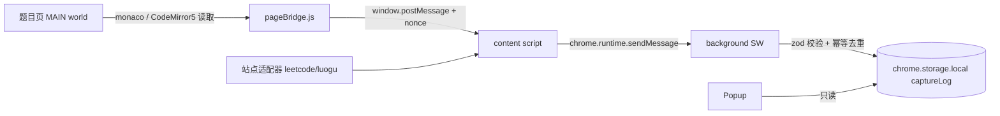

# leetX 阶段 0:采集可行性验证 实施计划

> **For agentic workers:** REQUIRED SUB-SKILL: 使用 superpowers:executing-plans(逐任务执行)或 superpowers:subagent-driven-development(逐任务派发)。每个任务完成后按任务内的提交步骤提交,再进入下一个任务。计划中所有代码均为完整实现,逐字使用;发现与真实环境不符(如 WXT 自动导入路径、站点选择器)时,按任务内的验证命令修正并在提交信息中说明。

## Goal(目标)

依据 `plan.md` 第 12/15 节,只做阶段 0:构建最小 Manifest V3 扩展,在真实的力扣(leetcode.cn / leetcode.com)与洛谷(www.luogu.com.cn)题目页上验证四类数据可稳定采集:**题目标识、完整代码、提交动作(按钮+快捷键)、判题结果**。采集结果落 `chrome.storage.local`,用一个最小 Popup 展示最近记录,使失败可见。

**验收(对应 plan.md 阶段 0 Go/No-Go)**:两站各至少 2 道题、2 种语言,代码/时间/状态可稳定保存;采集失败时有明确原因记录而非静默丢失。采集能力仍严格限定在阶段 0,不做会话自动聚合和真实 AI 调用;但正式扩展页面采用已经确认的三栏产品视觉,以本地捕获数据展示“记录 → 多次提交 → 代码与分析”的最终交互框架。

## Architecture(架构)



- 适配器只依赖 DOM 与 `SnapshotProvider` 接口,不感知存储与消息细节。
- content script 与 MAIN world 之间用带 nonce + requestId 的 `postMessage` 桥,仅暴露 `GET_EDITOR_SNAPSHOT`。
- background 只做校验、幂等、存储;所有状态落 `chrome.storage.local`,不依赖 SW 常驻。
- 所有纯逻辑(类型、schema、归一化、幂等键、桥、适配器、控制器、存储)都在 `src/` 下,用 Vitest + jsdom 单测;`entrypoints/` 只做接线。

## Tech Stack(技术栈)

WXT ^0.20、TypeScript、React 18(Popup 与独立工作台)、zod、Vitest + jsdom。Chrome/Edge MV3。阶段 0 的捕获日志继续使用 `chrome.storage.local`;阶段 1 才引入 Dexie 与真实 AI Provider。

## Confirmed Product UI(已确认产品视觉)

正式界面以 `leetx-demo/` 为唯一视觉基线,打开后直接进入产品工作台,不增加营销介绍、功能引导或演示封面。整体采用深色极客风格,背景色 `#080b13`,面板色 `#0e1420`,主强调色 `#b9f45c`,错误色 `#ff6c7a`,LeetCode 辅助色 `#ffb65f`,洛谷辅助色 `#61d9dd`;正文使用 Manrope,代码与元数据使用 DM Mono,面板圆角 10–12px,边框使用低透明度白色。

工作台固定采用“记录 → 多次提交 → 代码与分析”三栏信息架构。左栏展示按平台筛选的刷题记录;每条记录必须对应同平台、同题目的多次提交,Stage 0 尚未实现自动时间窗口聚合时,先按 `platform + problemKey` 对捕获日志进行只读分组。中栏展示当前记录的纵向提交时间线,节点包含序号、提交时间、语言、采集方式与判题状态。右栏占据最大宽度,同时展示当前代码、与上次提交的简单行级对比、节点采集分析以及记录总结。

Stage 0 不调用真实大模型。分析区域必须明确标识为“本地采集分析”,内容根据已采集字段确定性生成,例如代码长度变化、判题状态演进、采集方式、完整性与时间/空间复杂度待 AI 接入等;不得伪装为真实 AI 结论。后续接入 Provider 后复用同一组件和布局替换数据源。

Popup 只保留采集状态、最近提交、异常数量和“打开完整工作台”按钮,不承载三栏界面。独立工作台入口为 `entrypoints/app/`,使用 `browser.runtime.getURL('/app.html')` 或等价 WXT 入口打开。响应式规则为:桌面端三栏;中等宽度压缩左/中栏;窄屏按记录、时间线、详情顺序纵向排列。

## Global Constraints(全局约束)

1. 每个任务结束必须 `npm test` 全绿 + `npm run build` 通过(自任务 10 起)再提交;提交信息用 Conventional Commits。
2. 站点 DOM 选择器全部集中在各适配器 `selectors.ts`,其他文件禁止出现站点选择器。
3. 代码长度上限 200_000 字符,超限视为采集失败并上报 issue,不截断静默保存。
4. `accountKey` 阶段 0 统一为 `'anonymous'`(plan.md 14 节允许)。
5. 判题中间态("执行中""Judging"等)不写入;只有终态才发送 verdict 消息。
6. 不访问站点私有 API、不申请 `cookies`/`debugger`/`webRequest` 权限。
7. 测试文件与被测文件同目录,命名 `*.test.ts`;fixture 直接内联在测试里。
8. 禁止 `any` 逃逸到导出签名;跨 world 数据一律过 zod。

---

## Task 1: WXT + TypeScript + Vitest 工程脚手架

**Files:**
- Create: `package.json`
- Create: `wxt.config.ts`
- Create: `vitest.config.ts`
- Create: `tsconfig.json`
- Create: `entrypoints/background.ts`

**Interfaces:** 无对外接口;产出可构建、可测试的空工程。

- [ ] **Step 1: 写 `package.json`**

```json
{
  "name": "leetx",
  "private": true,
  "version": "0.0.1",
  "type": "module",
  "scripts": {
    "dev": "wxt",
    "build": "wxt build",
    "test": "vitest run --passWithNoTests",
    "postinstall": "wxt prepare"
  },
  "dependencies": {
    "zod": "^3.25.0"
  },
  "devDependencies": {
    "@types/chrome": "^0.0.287",
    "@types/react": "^18.3.3",
    "@types/react-dom": "^18.3.0",
    "jsdom": "^24.1.0",
    "react": "^18.3.1",
    "react-dom": "^18.3.1",
    "typescript": "^5.5.3",
    "vitest": "^2.1.9",
    "wxt": "^0.20.0"
  }
}
```

- [ ] **Step 2: 写 `wxt.config.ts`**

```ts
import { defineConfig } from 'wxt';

export default defineConfig({
  manifest: {
    name: 'leetX',
    description: 'Local-first practice capture for LeetCode and Luogu (stage 0).',
    permissions: ['storage'],
    host_permissions: [
      'https://leetcode.cn/*',
      'https://leetcode.com/*',
      'https://www.luogu.com.cn/*',
    ],
  },
});
```

- [ ] **Step 3: 写 `vitest.config.ts` 与 `tsconfig.json`**

```ts
// vitest.config.ts
import { defineConfig } from 'vitest/config';
import path from 'node:path';

export default defineConfig({
  test: {
    environment: 'jsdom',
    include: ['src/**/*.test.ts'],
  },
  resolve: {
    alias: { '@': path.resolve(__dirname, 'src') },
  },
});
```

```json
{
  "extends": "./.wxt/tsconfig.json"
}
```

- [ ] **Step 4: 写最小 background 入口 `entrypoints/background.ts`**

```ts
// WXT auto-imports defineBackground; no explicit import needed.
export default defineBackground(() => {
  console.log('[leetx] background started');
});
```

- [ ] **Step 5: 安装依赖并生成类型**

```bash
npm install
```

预期:`postinstall` 自动执行 `wxt prepare`,生成 `.wxt/tsconfig.json` 与自动导入类型。若 `postinstall` 未执行,手动 `npx wxt prepare`。

- [ ] **Step 6: 验证测试与构建**

```bash
npm test
npm run build
```

预期:测试输出 `No test files found` 但退出码 0(`--passWithNoTests`);构建产出 `.output/chrome-mv3/`。

- [ ] **Step 7: 提交**

```bash
git add package.json package-lock.json wxt.config.ts vitest.config.ts tsconfig.json entrypoints/background.ts
git commit -m "chore: scaffold WXT + TypeScript + Vitest project"
```

---

## Task 2: 共享类型与工具(utils + adapters/types)

**Files:**
- Create: `src/adapters/types.ts`
- Create: `src/utils/id.ts`
- Create: `src/utils/hash.ts`
- Create: `src/utils/hash.test.ts`

**Interfaces:**
- Consumes: 无。
- Produces: `Platform`、`ProblemIdentity`、`SubmitIntent`、`CodeSnapshot`、`CaptureMethod`、`Verdict`、`TerminalVerdict`、`VerdictSnapshot`、`SnapshotProvider`、`AdapterDeps`、`JudgeAdapter`(全部来自 `src/adapters/types.ts`);`newCaptureId()`;`sha256Hex()`。

- [ ] **Step 1: 写 `src/adapters/types.ts`**

```ts
export type Platform = 'leetcode-cn' | 'leetcode-com' | 'luogu';

export interface ProblemIdentity {
  platform: Platform;
  /** LeetCode slug (e.g. "two-sum") or Luogu pid (e.g. "P1001"). */
  problemKey: string;
  title: string;
  canonicalUrl: string;
  /** Stage 0: always 'anonymous' (see plan.md section 14). */
  accountKey: string;
}

export interface SubmitIntent {
  kind: 'click' | 'shortcut';
  at: number;
}

export type CaptureMethod = 'editor-model' | 'textarea' | 'rendered-code' | 'manual';

export interface CodeSnapshot {
  code: string;
  language: string;
  method: CaptureMethod;
}

export type Verdict =
  | 'pending'
  | 'accepted'
  | 'wrong_answer'
  | 'time_limit_exceeded'
  | 'memory_limit_exceeded'
  | 'runtime_error'
  | 'compile_error'
  | 'output_limit_exceeded'
  | 'cancelled'
  | 'unknown';

/** Terminal verdicts only; intermediate states are filtered by adapters. */
export type TerminalVerdict = Exclude<Verdict, 'pending'>;

export interface VerdictSnapshot {
  rawText: string;
  verdict: TerminalVerdict;
  runtimeText?: string;
  memoryText?: string;
  errorSummary?: string;
  at: number;
}

/** Implemented by the MAIN-world bridge client; consumed by adapters. */
export interface SnapshotProvider {
  getEditorSnapshot(): Promise<{ code: string; language: string } | null>;
}

export interface AdapterDeps {
  bridge: SnapshotProvider;
  now?: () => number;
}

export interface JudgeAdapter {
  platform: Platform;
  matchLocation(url: URL): boolean;
  observeRouteChange(callback: () => void): () => void;
  getProblemIdentity(): Promise<ProblemIdentity | null>;
  observeSubmit(callback: (event: SubmitIntent) => void): () => void;
  readEditorSnapshot(): Promise<CodeSnapshot | null>;
  observeVerdict(callback: (result: VerdictSnapshot) => void): () => void;
}
```

- [ ] **Step 2: 写 `src/utils/id.ts` 与 `src/utils/hash.ts`**

```ts
// src/utils/id.ts
export function newCaptureId(): string {
  return crypto.randomUUID();
}
```

```ts
// src/utils/hash.ts
export async function sha256Hex(text: string): Promise<string> {
  const bytes = new TextEncoder().encode(text);
  const digest = await crypto.subtle.digest('SHA-256', bytes);
  return Array.from(new Uint8Array(digest), (b) => b.toString(16).padStart(2, '0')).join('');
}
```

- [ ] **Step 3: 写 `src/utils/hash.test.ts`**

```ts
import { describe, expect, it } from 'vitest';
import { sha256Hex } from './hash';

describe('sha256Hex', () => {
  it('is deterministic for the same input', async () => {
    expect(await sha256Hex('print(1)')).toBe(await sha256Hex('print(1)'));
  });

  it('differs for different inputs and returns 64 hex chars', async () => {
    const a = await sha256Hex('a');
    const b = await sha256Hex('b');
    expect(a).not.toBe(b);
    expect(a).toMatch(/^[0-9a-f]{64}$/);
  });
});
```

- [ ] **Step 4: 运行测试并提交**

```bash
npm test
git add src/adapters/types.ts src/utils/id.ts src/utils/hash.ts src/utils/hash.test.ts
git commit -m "feat: add shared adapter types and hash/id utils"
```

---

## Task 3: 消息协议与 zod 校验

**Files:**
- Create: `src/messaging/messages.ts`
- Create: `src/messaging/messages.test.ts`

**Interfaces:**
- Consumes: `Platform`、`Verdict`、`CaptureMethod`(`src/adapters/types.ts`)。
- Produces: `captureSubmitSchema`、`captureVerdictSchema`、`captureIssueSchema`、`inboundMessageSchema`、`InboundMessage`、`CaptureSubmitMessage`、`CaptureVerdictMessage`、`CaptureIssueMessage`、`MAX_CODE_LENGTH`、`parseInboundMessage()`。

- [ ] **Step 1: 写 `src/messaging/messages.ts`**

```ts
import { z } from 'zod';

export const MAX_CODE_LENGTH = 200_000;

export const platformSchema = z.enum(['leetcode-cn', 'leetcode-com', 'luogu']);

export const verdictSchema = z.enum([
  'pending',
  'accepted',
  'wrong_answer',
  'time_limit_exceeded',
  'memory_limit_exceeded',
  'runtime_error',
  'compile_error',
  'output_limit_exceeded',
  'cancelled',
  'unknown',
]);

export const captureSubmitSchema = z.object({
  type: z.literal('leetx/capture-submit'),
  captureId: z.string().min(8),
  platform: platformSchema,
  problemKey: z.string().min(1),
  title: z.string(),
  canonicalUrl: z.string().url(),
  accountKey: z.string().min(1),
  language: z.string(),
  code: z.string().min(1).max(MAX_CODE_LENGTH),
  codeHash: z.string().min(8),
  captureMethod: z.enum(['editor-model', 'textarea', 'rendered-code', 'manual']),
  captureConfidence: z.enum(['high', 'medium', 'low']),
  submittedAt: z.number().int().positive(),
  sourceUrl: z.string().url(),
  issues: z.array(z.string()),
});

export const captureVerdictSchema = z.object({
  type: z.literal('leetx/capture-verdict'),
  captureId: z.string().min(8),
  verdict: verdictSchema,
  rawVerdict: z.string().min(1),
  runtimeText: z.string().optional(),
  memoryText: z.string().optional(),
  errorSummary: z.string().max(2000).optional(),
  observedAt: z.number().int().positive(),
});

export const captureIssueSchema = z.object({
  type: z.literal('leetx/capture-issue'),
  platform: platformSchema,
  reason: z.string().min(1),
  detail: z.string().max(1000).optional(),
  at: z.number().int().positive(),
});

export const inboundMessageSchema = z.discriminatedUnion('type', [
  captureSubmitSchema,
  captureVerdictSchema,
  captureIssueSchema,
]);

export type CaptureSubmitMessage = z.infer<typeof captureSubmitSchema>;
export type CaptureVerdictMessage = z.infer<typeof captureVerdictSchema>;
export type CaptureIssueMessage = z.infer<typeof captureIssueSchema>;
export type InboundMessage = z.infer<typeof inboundMessageSchema>;

/** Returns null for anything that fails validation; never throws. */
export function parseInboundMessage(raw: unknown): InboundMessage | null {
  const parsed = inboundMessageSchema.safeParse(raw);
  return parsed.success ? parsed.data : null;
}
```

- [ ] **Step 2: 写 `src/messaging/messages.test.ts`**

```ts
import { describe, expect, it } from 'vitest';
import { MAX_CODE_LENGTH, parseInboundMessage, type CaptureSubmitMessage } from './messages';

function validSubmit(): CaptureSubmitMessage {
  return {
    type: 'leetx/capture-submit',
    captureId: 'cap-00000001',
    platform: 'leetcode-cn',
    problemKey: 'two-sum',
    title: '两数之和',
    canonicalUrl: 'https://leetcode.cn/problems/two-sum/',
    accountKey: 'anonymous',
    language: 'python3',
    code: 'class Solution:\n    pass',
    codeHash: 'abc123def456',
    captureMethod: 'editor-model',
    captureConfidence: 'high',
    submittedAt: 1750000000000,
    sourceUrl: 'https://leetcode.cn/problems/two-sum/',
    issues: [],
  };
}

describe('parseInboundMessage', () => {
  it('accepts a valid submit message', () => {
    expect(parseInboundMessage(validSubmit())?.type).toBe('leetx/capture-submit');
  });

  it('accepts a valid verdict message', () => {
    const msg = {
      type: 'leetx/capture-verdict',
      captureId: 'cap-00000001',
      verdict: 'accepted',
      rawVerdict: '通过',
      observedAt: 1750000001000,
    };
    expect(parseInboundMessage(msg)?.type).toBe('leetx/capture-verdict');
  });

  it('rejects unknown message types and malformed fields', () => {
    expect(parseInboundMessage({ type: 'leetx/evil' })).toBeNull();
    expect(parseInboundMessage({ ...validSubmit(), platform: 'atcoder' })).toBeNull();
    expect(parseInboundMessage({ ...validSubmit(), submittedAt: -1 })).toBeNull();
    expect(parseInboundMessage(null)).toBeNull();
  });

  it('rejects code over the length cap', () => {
    const msg = { ...validSubmit(), code: 'x'.repeat(MAX_CODE_LENGTH + 1) };
    expect(parseInboundMessage(msg)).toBeNull();
  });
});
```

- [ ] **Step 3: 运行测试并提交**

```bash
npm test
git add src/messaging/messages.ts src/messaging/messages.test.ts
git commit -m "feat: add zod-validated capture message protocol"
```

---

## Task 4: 判题文案归一化与幂等键

**Files:**
- Create: `src/capture/normalize.ts`
- Create: `src/capture/normalize.test.ts`
- Create: `src/capture/deduplicate.ts`
- Create: `src/capture/deduplicate.test.ts`

**Interfaces:**
- Consumes: `TerminalVerdict`(types.ts)。
- Produces: `VerdictRule`、`normalizeVerdict()`;`buildIdempotencyKey()`(供 Task 9 存储层与 Task 8 控制器使用)。

- [ ] **Step 1: 写 `src/capture/normalize.ts`**

```ts
import type { TerminalVerdict } from '../adapters/types';

export type VerdictRule = readonly [RegExp, TerminalVerdict];

/**
 * Maps raw verdict text (Chinese or English) to a normalized terminal verdict.
 * Intermediate states ("执行中", "Judging"...) have no rule and return 'unknown',
 * which adapters treat as "not terminal yet".
 */
export function normalizeVerdict(raw: string, rules: readonly VerdictRule[]): TerminalVerdict {
  const text = raw.trim();
  for (const [pattern, verdict] of rules) {
    if (pattern.test(text)) return verdict;
  }
  return 'unknown';
}

/** Extracts a metric like runtime/memory from a result block's full text. */
export function extractMetric(text: string, labels: RegExp): string | undefined {
  const match = text.match(new RegExp(`(?:${labels.source})\\s*[:：]?\\s*([\\d.]+%?\\s*[a-zA-Z]+)`, labels.flags));
  return match?.[1]?.trim();
}
```

- [ ] **Step 2: 写 `src/capture/normalize.test.ts`**

```ts
import { describe, expect, it } from 'vitest';
import { extractMetric, normalizeVerdict, type VerdictRule } from './normalize';

const RULES: VerdictRule[] = [
  [/^Accepted/i, 'accepted'],
  [/Wrong Answer/i, 'wrong_answer'],
];

describe('normalizeVerdict', () => {
  it('maps the first matching rule', () => {
    expect(normalizeVerdict('Accepted', RULES)).toBe('accepted');
    expect(normalizeVerdict('  Wrong Answer  ', RULES)).toBe('wrong_answer');
  });

  it('returns unknown for intermediate or unrecognized states', () => {
    expect(normalizeVerdict('Judging...', RULES)).toBe('unknown');
    expect(normalizeVerdict('', RULES)).toBe('unknown');
  });
});

describe('extractMetric', () => {
  it('extracts runtime and memory values', () => {
    const text = '通过 执行用时: 4 ms 消耗内存: 18.2 MB';
    expect(extractMetric(text, /执行用时|Runtime/)).toBe('4 ms');
    expect(extractMetric(text, /消耗内存|Memory/)).toBe('18.2 MB');
  });

  it('returns undefined when the label is absent', () => {
    expect(extractMetric('解答错误', /执行用时|Runtime/)).toBeUndefined();
  });
});
```

- [ ] **Step 3: 写 `src/capture/deduplicate.ts`**

```ts
export interface IdempotencyInput {
  platform: string;
  problemKey: string;
  accountKey: string;
  submittedAt: number;
  language: string;
  codeHash: string;
}

/**
 * Idempotency key per plan.md section 5.3:
 * platform + problemKey + accountKey + floor(submittedAt / 5s) + language + codeHash.
 * Deliberately NOT deduped by codeHash alone: users may resubmit identical code.
 */
export function buildIdempotencyKey(input: IdempotencyInput): string {
  const bucket = Math.floor(input.submittedAt / 5000);
  return [
    input.platform,
    input.problemKey,
    input.accountKey,
    String(bucket),
    input.language,
    input.codeHash,
  ].join('|');
}
```

- [ ] **Step 4: 写 `src/capture/deduplicate.test.ts`**

```ts
import { describe, expect, it } from 'vitest';
import { buildIdempotencyKey, type IdempotencyInput } from './deduplicate';

function base(): IdempotencyInput {
  return {
    platform: 'leetcode-cn',
    problemKey: 'two-sum',
    accountKey: 'anonymous',
    submittedAt: 1_750_000_000_000,
    language: 'python3',
    codeHash: 'deadbeef',
  };
}

describe('buildIdempotencyKey', () => {
  it('is identical within the same 5s bucket', () => {
    const a = buildIdempotencyKey({ ...base(), submittedAt: 1_750_000_000_000 });
    const b = buildIdempotencyKey({ ...base(), submittedAt: 1_750_000_004_999 });
    expect(a).toBe(b);
  });

  it('differs across bucket boundaries', () => {
    const a = buildIdempotencyKey({ ...base(), submittedAt: 1_750_000_000_000 });
    const b = buildIdempotencyKey({ ...base(), submittedAt: 1_750_000_005_000 });
    expect(a).not.toBe(b);
  });

  it('differs when account, language or codeHash change', () => {
    const a = buildIdempotencyKey(base());
    expect(buildIdempotencyKey({ ...base(), accountKey: 'alice' })).not.toBe(a);
    expect(buildIdempotencyKey({ ...base(), language: 'cpp' })).not.toBe(a);
    expect(buildIdempotencyKey({ ...base(), codeHash: 'cafe' })).not.toBe(a);
  });
});
```

- [ ] **Step 5: 运行测试并提交**

```bash
npm test
git add src/capture/normalize.ts src/capture/normalize.test.ts src/capture/deduplicate.ts src/capture/deduplicate.test.ts
git commit -m "feat: add verdict normalization and idempotency key"
```

---

## Task 5: MAIN-world 桥(协议、pageBridge、content 客户端)

**Files:**
- Create: `src/bridge/protocol.ts`
- Create: `src/bridge/pageBridge.ts`
- Create: `src/bridge/client.ts`
- Create: `src/bridge/bridge.test.ts`

**Interfaces:**
- Consumes: `SnapshotProvider`(types.ts)。
- Produces: `BRIDGE_CHANNEL`、`bridgeResponseSchema`、`installPageBridge(nonce)`、`readMainWorldSnapshot()`、`createBridgeClient(opts)`、`BridgeClient`(= `SnapshotProvider`)。

设计要点:nonce 由 content script 生成并写入 `document.documentElement.dataset.leetxNonce`,pageBridge 安装时读取;响应带相同 nonce + requestId 且过 zod;超时或非法响应一律返回 `null`(走降级路径),不抛异常。

- [ ] **Step 1: 写 `src/bridge/protocol.ts`**

```ts
import { z } from 'zod';

export const BRIDGE_CHANNEL = 'leetx-bridge-v1';

export const bridgeRequestSchema = z.object({
  source: z.literal('leetx-content'),
  channel: z.literal(BRIDGE_CHANNEL),
  nonce: z.string().min(8),
  requestId: z.string().min(8),
  action: z.literal('GET_EDITOR_SNAPSHOT'),
});

export const bridgeResponseSchema = z.object({
  source: z.literal('leetx-page'),
  channel: z.literal(BRIDGE_CHANNEL),
  nonce: z.string().min(8),
  requestId: z.string().min(8),
  ok: z.boolean(),
  payload: z.object({ code: z.string(), language: z.string() }).optional(),
  error: z.string().optional(),
});

export type BridgeRequest = z.infer<typeof bridgeRequestSchema>;
export type BridgeResponse = z.infer<typeof bridgeResponseSchema>;
```

- [ ] **Step 2: 写 `src/bridge/pageBridge.ts`(运行在 MAIN world)**

```ts
import { BRIDGE_CHANNEL, bridgeRequestSchema } from './protocol';

interface MonacoModelLike {
  getValue(): string;
  getLanguageId?(): string;
}

interface CodeMirror5Like {
  getValue(): string;
  getOption?(key: string): unknown;
}

/**
 * Reads full editor content from page-global editor objects.
 * Covers Monaco (both LeetCode and Luogu use it) and CodeMirror 5
 * (exposed as a .CodeMirror property on its wrapper element).
 */
export function readMainWorldSnapshot(): { code: string; language: string } | null {
  const monaco = (window as unknown as {
    monaco?: { editor?: { getModels?: () => MonacoModelLike[] } };
  }).monaco;
  const models = monaco?.editor?.getModels?.() ?? [];
  const model = models.find((m) => m.getValue().trim().length > 0);
  if (model) {
    return { code: model.getValue(), language: model.getLanguageId?.() ?? '' };
  }

  const cmHost = document.querySelector('.CodeMirror') as
    | (Element & { CodeMirror?: CodeMirror5Like })
    | null;
  const cm = cmHost?.CodeMirror;
  if (cm) {
    const code = cm.getValue();
    if (code.trim().length > 0) {
      const mode = cm.getOption?.('mode');
      return { code, language: typeof mode === 'string' ? mode : '' };
    }
  }
  return null;
}

export function installPageBridge(nonce: string): void {
  window.addEventListener('message', (event: MessageEvent) => {
    const parsed = bridgeRequestSchema.safeParse(event.data);
    if (!parsed.success) return;
    const request = parsed.data;
    if (request.nonce !== nonce) return;

    let response: Record<string, unknown>;
    try {
      const snapshot = readMainWorldSnapshot();
      response = snapshot
        ? { ok: true, payload: snapshot }
        : { ok: false, error: 'no-editor-found' };
    } catch (error) {
      response = { ok: false, error: String(error) };
    }

    window.postMessage(
      {
        source: 'leetx-page',
        channel: BRIDGE_CHANNEL,
        nonce,
        requestId: request.requestId,
        ...response,
      },
      location.origin,
    );
  });
}
```

- [ ] **Step 3: 写 `src/bridge/client.ts`(运行在 content script / isolated world)**

```ts
import type { SnapshotProvider } from '../adapters/types';
import { MAX_CODE_LENGTH } from '../messaging/messages';
import { BRIDGE_CHANNEL, bridgeResponseSchema } from './protocol';

export type BridgeClient = SnapshotProvider;

export interface BridgeClientOptions {
  nonce?: string;
  timeoutMs?: number;
  maxCodeLength?: number;
}

export function createBridgeClient(options: BridgeClientOptions = {}): SnapshotProvider {
  const nonce = options.nonce ?? document.documentElement.dataset.leetxNonce ?? '';
  const timeoutMs = options.timeoutMs ?? 1500;
  const maxCodeLength = options.maxCodeLength ?? MAX_CODE_LENGTH;

  return {
    getEditorSnapshot() {
      const requestId = crypto.randomUUID();
      return new Promise((resolve) => {
        const finish = (value: { code: string; language: string } | null) => {
          clearTimeout(timer);
          window.removeEventListener('message', onMessage);
          resolve(value);
        };
        const onMessage = (event: MessageEvent) => {
          const parsed = bridgeResponseSchema.safeParse(event.data);
          if (!parsed.success) return;
          const response = parsed.data;
          if (response.nonce !== nonce || response.requestId !== requestId) return;
          if (!response.ok || !response.payload) return finish(null);
          if (response.payload.code.length > maxCodeLength) return finish(null);
          finish(response.payload);
        };
        const timer = setTimeout(() => finish(null), timeoutMs);
        window.addEventListener('message', onMessage);
        window.postMessage(
          {
            source: 'leetx-content',
            channel: BRIDGE_CHANNEL,
            nonce,
            requestId,
            action: 'GET_EDITOR_SNAPSHOT',
          },
          location.origin,
        );
      });
    },
  };
}
```

- [ ] **Step 4: 写 `src/bridge/bridge.test.ts`**

jsdom 里 content 与 page 共用一个 window,恰好可模拟跨 world 通信。

```ts
import { afterEach, describe, expect, it } from 'vitest';
import { createBridgeClient } from './client';
import { installPageBridge } from './pageBridge';

const NONCE = 'test-nonce-123456';

function setMonaco(code: string, language: string) {
  (window as unknown as { monaco?: unknown }).monaco = {
    editor: {
      getModels: () => [{ getValue: () => code, getLanguageId: () => language }],
    },
  };
}

afterEach(() => {
  delete (window as unknown as { monaco?: unknown }).monaco;
  document.body.innerHTML = '';
});

describe('bridge roundtrip', () => {
  it('returns the monaco model content', async () => {
    setMonaco('print(42)', 'python');
    installPageBridge(NONCE);
    const client = createBridgeClient({ nonce: NONCE });
    await expect(client.getEditorSnapshot()).resolves.toEqual({ code: 'print(42)', language: 'python' });
  });

  it('falls back to CodeMirror 5 host element', async () => {
    document.body.innerHTML = '<div class="CodeMirror"></div>';
    const host = document.querySelector('.CodeMirror') as Element & {
      CodeMirror?: { getValue(): string; getOption(k: string): unknown };
    };
    host.CodeMirror = { getValue: () => 'int main() {}', getOption: () => 'text/x-c++src' };
    installPageBridge(NONCE);
    const client = createBridgeClient({ nonce: NONCE });
    await expect(client.getEditorSnapshot()).resolves.toEqual({
      code: 'int main() {}',
      language: 'text/x-c++src',
    });
  });

  it('resolves null when no editor exists', async () => {
    installPageBridge(NONCE);
    const client = createBridgeClient({ nonce: NONCE });
    await expect(client.getEditorSnapshot()).resolves.toBeNull();
  });

  it('resolves null on timeout when no bridge is installed', async () => {
    const client = createBridgeClient({ nonce: NONCE, timeoutMs: 50 });
    await expect(client.getEditorSnapshot()).resolves.toBeNull();
  });

  it('ignores responses with a wrong nonce', async () => {
    setMonaco('x', 'python');
    installPageBridge('other-nonce-999');
    const client = createBridgeClient({ nonce: NONCE, timeoutMs: 50 });
    await expect(client.getEditorSnapshot()).resolves.toBeNull();
  });
});
```

- [ ] **Step 5: 运行测试并提交**

```bash
npm test
git add src/bridge/protocol.ts src/bridge/pageBridge.ts src/bridge/client.ts src/bridge/bridge.test.ts
git commit -m "feat: add nonce-guarded MAIN-world editor bridge"
```

---

## Task 6: LeetCode 适配器(cn/com 共用)

**Files:**
- Create: `src/adapters/route.ts`
- Create: `src/adapters/leetcode/selectors.ts`
- Create: `src/adapters/leetcode/verdict.ts`
- Create: `src/adapters/leetcode/editor.ts`
- Create: `src/adapters/leetcode/adapter.ts`
- Create: `src/adapters/leetcode/adapter.test.ts`

**Interfaces:**
- Consumes: `JudgeAdapter`、`AdapterDeps`、`ProblemIdentity`、`CodeSnapshot`(types.ts);`normalizeVerdict`、`extractMetric`(capture/normalize.ts);`SnapshotProvider`。
- Produces: `createLeetCodeAdapter(platform, deps)`;`observeSpaRouteChange(callback, opts)`;`LEETCODE_VERDICT_RULES`。

注意:content script 运行在 isolated world,无法 patch 页面 `history.pushState`,所以路由监听采用 `popstate` + 轮询 `location.href`(默认 500ms),见 `src/adapters/route.ts`。

- [ ] **Step 1: 写 `src/adapters/route.ts`**

```ts
export interface RouteWatchOptions {
  intervalMs?: number;
}

/**
 * Watches SPA navigations from an isolated world: patching history there does
 * not observe page-world pushState, so we poll location.href plus popstate.
 */
export function observeSpaRouteChange(
  callback: () => void,
  options: RouteWatchOptions = {},
): () => void {
  const intervalMs = options.intervalMs ?? 500;
  let lastHref = location.href;
  const check = () => {
    if (location.href !== lastHref) {
      lastHref = location.href;
      callback();
    }
  };
  window.addEventListener('popstate', check);
  const timer = setInterval(check, intervalMs);
  return () => {
    window.removeEventListener('popstate', check);
    clearInterval(timer);
  };
}
```

- [ ] **Step 2: 写 `src/adapters/leetcode/selectors.ts`**

选择器是阶段 0 重点验证对象,若人工验收发现失效,只改这个文件。

```ts
export const LEETCODE_SELECTORS = {
  /** Primary submit button; fallback is button text matching submitButtonText. */
  submitButton: '[data-e2e-locator="console-submit-button"]',
  submitButtonText: /^(提交|Submit)$/,
  /** Result region that appears after running/submitting. */
  resultRegion: '[data-e2e-locator="console-result"]',
  /** Rendered (non-virtualized fallback) code content, used when bridge fails. */
  renderedCode: '.cm-content',
  /** Language selector button candidates (first match wins). */
  languageButtons: '[data-e2e-locator="language-select"], .editor-toolbar button, .mr-2 .inline-flex',
  /** Stable ancestor for the MutationObserver. */
  observerRoot: '#qd-content',
} as const;
```

- [ ] **Step 3: 写 `src/adapters/leetcode/verdict.ts`**

```ts
import type { TerminalVerdict } from '../types';
import { extractMetric, normalizeVerdict, type VerdictRule } from '../../capture/normalize';

export const LEETCODE_VERDICT_RULES: VerdictRule[] = [
  [/^(通过|Accepted)\b/i, 'accepted'],
  [/解答错误|Wrong Answer/i, 'wrong_answer'],
  [/超出时间限制|Time Limit Exceeded/i, 'time_limit_exceeded'],
  [/超出内存限制|Memory Limit Exceeded/i, 'memory_limit_exceeded'],
  [/运行时错误|Runtime Error/i, 'runtime_error'],
  [/编译错误|Compile Error|Compilation Error/i, 'compile_error'],
  [/超出输出限制|Output Limit Exceeded/i, 'output_limit_exceeded'],
];

export function normalizeLeetCodeVerdict(raw: string): TerminalVerdict {
  return normalizeVerdict(raw, LEETCODE_VERDICT_RULES);
}

export function extractLeetCodeMetrics(text: string): { runtimeText?: string; memoryText?: string } {
  return {
    runtimeText: extractMetric(text, /执行用时|Runtime/i),
    memoryText: extractMetric(text, /消耗内存|Memory/i),
  };
}
```

- [ ] **Step 4: 写 `src/adapters/leetcode/editor.ts`**

```ts
import type { CodeSnapshot, SnapshotProvider } from '../types';
import { LEETCODE_SELECTORS } from './selectors';

function detectLanguage(): string {
  for (const el of Array.from(document.querySelectorAll(LEETCODE_SELECTORS.languageButtons))) {
    const text = el.textContent?.trim();
    if (text && text.length <= 20) return text;
  }
  return '';
}

/**
 * Read priority (plan.md section 5.2): MAIN-world editor model first,
 * then fully-rendered code text. Never scrape virtualized visible rows.
 */
export async function readLeetCodeSnapshot(bridge: SnapshotProvider): Promise<CodeSnapshot | null> {
  const fromBridge = await bridge.getEditorSnapshot();
  if (fromBridge && fromBridge.code.trim().length > 0) {
    return {
      code: fromBridge.code,
      language: fromBridge.language || detectLanguage(),
      method: 'editor-model',
    };
  }

  const rendered = document.querySelector(LEETCODE_SELECTORS.renderedCode);
  const code = rendered?.textContent ?? '';
  if (code.trim().length > 0) {
    return { code, language: detectLanguage(), method: 'rendered-code' };
  }
  return null;
}
```

- [ ] **Step 5: 写 `src/adapters/leetcode/adapter.ts`**

```ts
import type { AdapterDeps, JudgeAdapter, ProblemIdentity, SubmitIntent, VerdictSnapshot } from '../types';
import { observeSpaRouteChange } from '../route';
import { readLeetCodeSnapshot } from './editor';
import { LEETCODE_SELECTORS } from './selectors';
import { extractLeetCodeMetrics, normalizeLeetCodeVerdict } from './verdict';

const PATH_PATTERN = /^\/problems\/[\w-]+\/?/;

export function createLeetCodeAdapter(
  platform: 'leetcode-cn' | 'leetcode-com',
  deps: AdapterDeps,
): JudgeAdapter {
  const now = deps.now ?? (() => Date.now());

  return {
    platform,

    matchLocation: (url: URL) => PATH_PATTERN.test(url.pathname),

    observeRouteChange: (callback) => observeSpaRouteChange(callback),

    async getProblemIdentity(): Promise<ProblemIdentity | null> {
      const match = location.pathname.match(/^\/problems\/([\w-]+)/);
      if (!match) return null;
      const slug = match[1];
      const heading = document
        .querySelector('h1, [class*="question-title"], [class*="text-title"]')
        ?.textContent?.trim();
      const title =
        heading && heading.length > 0
          ? heading
          : document.title.replace(/[_-]?\s*(力扣|LeetCode).*$/i, '').trim();
      return {
        platform,
        problemKey: slug,
        title,
        canonicalUrl: `${location.origin}/problems/${slug}/`,
        accountKey: 'anonymous',
      };
    },

    observeSubmit(callback: (event: SubmitIntent) => void): () => void {
      const onClick = (event: MouseEvent) => {
        const button = (event.target as Element | null)?.closest?.('button');
        if (!button) return;
        const isSubmit =
          button.matches(LEETCODE_SELECTORS.submitButton) ||
          LEETCODE_SELECTORS.submitButtonText.test(button.textContent?.trim() ?? '');
        if (isSubmit) callback({ kind: 'click', at: now() });
      };
      const onKeydown = (event: KeyboardEvent) => {
        if ((event.ctrlKey || event.metaKey) && event.key === 'Enter') {
          callback({ kind: 'shortcut', at: now() });
        }
      };
      document.addEventListener('click', onClick, true);
      document.addEventListener('keydown', onKeydown, true);
      return () => {
        document.removeEventListener('click', onClick, true);
        document.removeEventListener('keydown', onKeydown, true);
      };
    },

    readEditorSnapshot: () => readLeetCodeSnapshot(deps.bridge),

    observeVerdict(callback: (result: VerdictSnapshot) => void): () => void {
      let timer: ReturnType<typeof setTimeout> | undefined;
      let lastEmittedText = '';
      const emit = () => {
        const region = document.querySelector(LEETCODE_SELECTORS.resultRegion);
        const text = region?.textContent?.trim() ?? '';
        if (!text || text === lastEmittedText) return;
        const verdict = normalizeLeetCodeVerdict(text);
        if (verdict === 'unknown') return; // intermediate state, keep waiting
        lastEmittedText = text;
        const metrics = extractLeetCodeMetrics(text);
        callback({ rawText: text, verdict, at: now(), ...metrics });
      };
      const root = document.querySelector(LEETCODE_SELECTORS.observerRoot) ?? document.body;
      const observer = new MutationObserver(() => {
        clearTimeout(timer);
        timer = setTimeout(emit, 150);
      });
      observer.observe(root, { childList: true, subtree: true, characterData: true });
      return () => {
        clearTimeout(timer);
        observer.disconnect();
      };
    },
  };
}
```

- [ ] **Step 6: 写 `src/adapters/leetcode/adapter.test.ts`**

```ts
import { afterEach, beforeEach, describe, expect, it, vi } from 'vitest';
import type { SnapshotProvider, VerdictSnapshot } from '../types';
import { createLeetCodeAdapter } from './adapter';

function fakeLoc(pathname: string, origin = 'https://leetcode.cn'): URL {
  return new URL(pathname, origin);
}

function bridgeReturning(code: string | null): SnapshotProvider {
  return {
    getEditorSnapshot: () => Promise.resolve(code ? { code, language: 'python' } : null),
  };
}

beforeEach(() => {
  window.history.pushState({}, '', '/problems/two-sum/');
  document.body.innerHTML = '';
});

afterEach(() => {
  vi.useRealTimers();
  document.body.innerHTML = '';
});

describe('leetcode adapter', () => {
  it('matches problem pages on both domains', () => {
    const adapter = createLeetCodeAdapter('leetcode-cn', { bridge: bridgeReturning(null) });
    expect(adapter.matchLocation(fakeLoc('/problems/two-sum/'))).toBe(true);
    expect(adapter.matchLocation(fakeLoc('/problems/two-sum', 'https://leetcode.com'))).toBe(true);
    expect(adapter.matchLocation(fakeLoc('/problemset/all/'))).toBe(false);
  });

  it('extracts problem identity from URL and document title', async () => {
    document.title = '两数之和 - 力扣(LeetCode)';
    const adapter = createLeetCodeAdapter('leetcode-cn', { bridge: bridgeReturning(null) });
    const identity = await adapter.getProblemIdentity();
    expect(identity).toEqual({
      platform: 'leetcode-cn',
      problemKey: 'two-sum',
      title: '两数之和',
      canonicalUrl: `${location.origin}/problems/two-sum/`,
      accountKey: 'anonymous',
    });
  });

  it('returns null identity off problem pages', async () => {
    window.history.pushState({}, '', '/problemset/all/');
    const adapter = createLeetCodeAdapter('leetcode-cn', { bridge: bridgeReturning(null) });
    await expect(adapter.getProblemIdentity()).resolves.toBeNull();
  });

  it('reads code via the bridge first, with rendered-code fallback', async () => {
    const viaBridge = createLeetCodeAdapter('leetcode-cn', { bridge: bridgeReturning('print(1)') });
    await expect(viaBridge.readEditorSnapshot()).resolves.toMatchObject({
      code: 'print(1)',
      method: 'editor-model',
    });

    document.body.innerHTML = '<div class="cm-content">print(2)</div>';
    const fallback = createLeetCodeAdapter('leetcode-cn', { bridge: bridgeReturning(null) });
    await expect(fallback.readEditorSnapshot()).resolves.toMatchObject({
      code: 'print(2)',
      method: 'rendered-code',
    });
  });

  it('fires submit intent on button click and Ctrl+Enter', () => {
    const adapter = createLeetCodeAdapter('leetcode-cn', { bridge: bridgeReturning(null), now: () => 123 });
    document.body.innerHTML = '<button data-e2e-locator="console-submit-button">提交</button>';
    const events: string[] = [];
    const dispose = adapter.observeSubmit((e) => events.push(`${e.kind}@${e.at}`));
    document.querySelector('button')!.click();
    document.dispatchEvent(new KeyboardEvent('keydown', { key: 'Enter', ctrlKey: true }));
    dispose();
    expect(events).toEqual(['click@123', 'shortcut@123']);
  });

  it('emits terminal verdicts only, debounced, ignoring intermediate states', async () => {
    vi.useFakeTimers();
    const adapter = createLeetCodeAdapter('leetcode-cn', { bridge: bridgeReturning(null), now: () => 456 });
    document.body.innerHTML =
      '<div id="qd-content"><div data-e2e-locator="console-result"></div></div>';
    const results: VerdictSnapshot[] = [];
    const dispose = adapter.observeVerdict((r) => results.push(r));

    const region = document.querySelector('[data-e2e-locator="console-result"]')!;
    region.textContent = '执行中...';
    await vi.advanceTimersByTimeAsync(300);
    expect(results).toEqual([]);

    region.textContent = '通过 执行用时: 4 ms 消耗内存: 18.2 MB';
    await vi.advanceTimersByTimeAsync(300);
    expect(results).toHaveLength(1);
    expect(results[0]).toMatchObject({
      verdict: 'accepted',
      runtimeText: '4 ms',
      memoryText: '18.2 MB',
      at: 456,
    });
    dispose();
  });
});
```

- [ ] **Step 7: 运行测试并提交**

```bash
npm test
git add src/adapters/route.ts src/adapters/leetcode/
git commit -m "feat: add LeetCode adapter with editor, submit and verdict capture"
```

---

## Task 7: 洛谷适配器

**Files:**
- Create: `src/adapters/luogu/selectors.ts`
- Create: `src/adapters/luogu/verdict.ts`
- Create: `src/adapters/luogu/editor.ts`
- Create: `src/adapters/luogu/adapter.ts`
- Create: `src/adapters/luogu/adapter.test.ts`

**Interfaces:**
- Consumes: 同 Task 6。
- Produces: `createLuoguAdapter(deps)`;`LUOGU_VERDICT_RULES`。

洛谷要点:题目 URL 为 `/problem/P1001`;编辑器为 Monaco(bridge 可覆盖),提交按钮文案"提交评测";判题状态文案为英文(`Accepted`、`Wrong Answer`、`Time Limit Exceeded`...),中间态为 `Judging`。选择器同样是阶段 0 验证对象。

- [ ] **Step 1: 写 `src/adapters/luogu/selectors.ts`**

```ts
export const LUOGU_SELECTORS = {
  /** Submit button candidates; fallback is text matching submitButtonText. */
  submitButton: 'button.submit, button[data-v-][class*="submit"]',
  submitButtonText: /提交评测|^提交$/,
  /** Verdict / record panel that updates during judging. */
  resultRegion: '.record-detail, .test-case, [class*="judge-result"], .status',
  /** Rendered code fallback. */
  renderedCode: '.cm-content, pre code',
  /** Language select candidates. */
  languageButtons: '.lang-select, select[name="language"], [class*="language"] button',
  /** Stable ancestor for the MutationObserver. */
  observerRoot: '.app, #app, main',
} as const;
```

- [ ] **Step 2: 写 `src/adapters/luogu/verdict.ts`**

```ts
import type { TerminalVerdict } from '../types';
import { extractMetric, normalizeVerdict, type VerdictRule } from '../../capture/normalize';

export const LUOGU_VERDICT_RULES: VerdictRule[] = [
  [/^Accepted\b/i, 'accepted'],
  [/Wrong Answer/i, 'wrong_answer'],
  [/Time Limit Exceeded/i, 'time_limit_exceeded'],
  [/Memory Limit Exceeded/i, 'memory_limit_exceeded'],
  [/Runtime Error/i, 'runtime_error'],
  [/Compile Error/i, 'compile_error'],
  [/Output Limit Exceeded/i, 'output_limit_exceeded'],
];

export function normalizeLuoguVerdict(raw: string): TerminalVerdict {
  return normalizeVerdict(raw, LUOGU_VERDICT_RULES);
}

export function extractLuoguMetrics(text: string): { runtimeText?: string; memoryText?: string } {
  return {
    runtimeText: extractMetric(text, /time|用时/i),
    memoryText: extractMetric(text, /memory|内存/i),
  };
}
```

- [ ] **Step 3: 写 `src/adapters/luogu/editor.ts`**

```ts
import type { CodeSnapshot, SnapshotProvider } from '../types';
import { LUOGU_SELECTORS } from './selectors';

function detectLanguage(): string {
  for (const el of Array.from(document.querySelectorAll(LUOGU_SELECTORS.languageButtons))) {
    if (el instanceof HTMLSelectElement) {
      const option = el.selectedOptions[0]?.textContent?.trim();
      if (option) return option;
      continue;
    }
    const text = el.textContent?.trim();
    if (text && text.length <= 20) return text;
  }
  return '';
}

export async function readLuoguSnapshot(bridge: SnapshotProvider): Promise<CodeSnapshot | null> {
  const fromBridge = await bridge.getEditorSnapshot();
  if (fromBridge && fromBridge.code.trim().length > 0) {
    return {
      code: fromBridge.code,
      language: fromBridge.language || detectLanguage(),
      method: 'editor-model',
    };
  }

  const rendered = document.querySelector(LUOGU_SELECTORS.renderedCode);
  const code = rendered?.textContent ?? '';
  if (code.trim().length > 0) {
    return { code, language: detectLanguage(), method: 'rendered-code' };
  }
  return null;
}
```

- [ ] **Step 4: 写 `src/adapters/luogu/adapter.ts`**

```ts
import type { AdapterDeps, JudgeAdapter, ProblemIdentity, SubmitIntent, VerdictSnapshot } from '../types';
import { observeSpaRouteChange } from '../route';
import { readLuoguSnapshot } from './editor';
import { LUOGU_SELECTORS } from './selectors';
import { extractLuoguMetrics, normalizeLuoguVerdict } from './verdict';

const PATH_PATTERN = /^\/problem\/[\w-]+\/?/;

export function createLuoguAdapter(deps: AdapterDeps): JudgeAdapter {
  const now = deps.now ?? (() => Date.now());

  return {
    platform: 'luogu',

    matchLocation: (url: URL) =>
      /(^|\.)luogu\.com\.cn$/.test(url.hostname) && PATH_PATTERN.test(url.pathname),

    observeRouteChange: (callback) => observeSpaRouteChange(callback),

    async getProblemIdentity(): Promise<ProblemIdentity | null> {
      const match = location.pathname.match(/^\/problem\/([\w-]+)/);
      if (!match) return null;
      const pid = match[1];
      const heading = document.querySelector('h1')?.textContent?.trim();
      const title =
        heading && heading.length > 0
          ? heading
          : document.title.replace(/\s*[-_]\s*洛谷.*$/i, '').trim();
      return {
        platform: 'luogu',
        problemKey: pid,
        title,
        canonicalUrl: `${location.origin}/problem/${pid}`,
        accountKey: 'anonymous',
      };
    },

    observeSubmit(callback: (event: SubmitIntent) => void): () => void {
      const onClick = (event: MouseEvent) => {
        const button = (event.target as Element | null)?.closest?.('button');
        if (!button) return;
        const isSubmit =
          button.matches(LUOGU_SELECTORS.submitButton) ||
          LUOGU_SELECTORS.submitButtonText.test(button.textContent?.trim() ?? '');
        if (isSubmit) callback({ kind: 'click', at: now() });
      };
      const onKeydown = (event: KeyboardEvent) => {
        if ((event.ctrlKey || event.metaKey) && event.key === 'Enter') {
          callback({ kind: 'shortcut', at: now() });
        }
      };
      document.addEventListener('click', onClick, true);
      document.addEventListener('keydown', onKeydown, true);
      return () => {
        document.removeEventListener('click', onClick, true);
        document.removeEventListener('keydown', onKeydown, true);
      };
    },

    readEditorSnapshot: () => readLuoguSnapshot(deps.bridge),

    observeVerdict(callback: (result: VerdictSnapshot) => void): () => void {
      let timer: ReturnType<typeof setTimeout> | undefined;
      let lastEmittedText = '';
      const emit = () => {
        for (const region of Array.from(document.querySelectorAll(LUOGU_SELECTORS.resultRegion))) {
          const text = region.textContent?.trim() ?? '';
          if (!text || text === lastEmittedText) continue;
          const verdict = normalizeLuoguVerdict(text);
          if (verdict === 'unknown') continue; // e.g. "Judging"
          lastEmittedText = text;
          const metrics = extractLuoguMetrics(text);
          callback({ rawText: text, verdict, at: now(), ...metrics });
          return;
        }
      };
      const root = document.querySelector(LUOGU_SELECTORS.observerRoot) ?? document.body;
      const observer = new MutationObserver(() => {
        clearTimeout(timer);
        timer = setTimeout(emit, 150);
      });
      observer.observe(root, { childList: true, subtree: true, characterData: true });
      return () => {
        clearTimeout(timer);
        observer.disconnect();
      };
    },
  };
}
```

- [ ] **Step 5: 写 `src/adapters/luogu/adapter.test.ts`**

```ts
import { afterEach, beforeEach, describe, expect, it, vi } from 'vitest';
import type { SnapshotProvider, VerdictSnapshot } from '../types';
import { createLuoguAdapter } from './adapter';

function fakeLoc(pathname: string, origin = 'https://www.luogu.com.cn'): URL {
  return new URL(pathname, origin);
}

function bridgeReturning(code: string | null): SnapshotProvider {
  return {
    getEditorSnapshot: () => Promise.resolve(code ? { code, language: 'cpp' } : null),
  };
}

beforeEach(() => {
  window.history.pushState({}, '', '/problem/P1001');
  document.body.innerHTML = '';
});

afterEach(() => {
  vi.useRealTimers();
  document.body.innerHTML = '';
});

describe('luogu adapter', () => {
  it('matches luogu problem pages only', () => {
    const adapter = createLuoguAdapter({ bridge: bridgeReturning(null) });
    expect(adapter.matchLocation(fakeLoc('/problem/P1001'))).toBe(true);
    expect(adapter.matchLocation(fakeLoc('/problem/B2001'))).toBe(true);
    expect(adapter.matchLocation(fakeLoc('/problem/list'))).toBe(true);
    expect(adapter.matchLocation(fakeLoc('/problems/two-sum', 'https://leetcode.cn'))).toBe(false);
  });

  it('extracts pid and title from h1', async () => {
    document.body.innerHTML = '<h1>P1001 A+B Problem</h1>';
    const adapter = createLuoguAdapter({ bridge: bridgeReturning(null) });
    const identity = await adapter.getProblemIdentity();
    expect(identity).toMatchObject({
      platform: 'luogu',
      problemKey: 'P1001',
      title: 'P1001 A+B Problem',
      accountKey: 'anonymous',
    });
    expect(identity?.canonicalUrl).toBe(`${location.origin}/problem/P1001`);
  });

  it('reads code via the bridge, with rendered-code fallback', async () => {
    const viaBridge = createLuoguAdapter({ bridge: bridgeReturning('#include <cstdio>') });
    await expect(viaBridge.readEditorSnapshot()).resolves.toMatchObject({
      method: 'editor-model',
    });

    document.body.innerHTML = '<pre><code>int main(){return 0;}</code></pre>';
    const fallback = createLuoguAdapter({ bridge: bridgeReturning(null) });
    await expect(fallback.readEditorSnapshot()).resolves.toMatchObject({
      code: 'int main(){return 0;}',
      method: 'rendered-code',
    });
  });

  it('fires submit intent on 提交评测 button click and Ctrl+Enter', () => {
    const adapter = createLuoguAdapter({ bridge: bridgeReturning(null), now: () => 123 });
    document.body.innerHTML = '<button class="submit">提交评测</button>';
    const events: string[] = [];
    const dispose = adapter.observeSubmit((e) => events.push(`${e.kind}@${e.at}`));
    document.querySelector('button')!.click();
    document.dispatchEvent(new KeyboardEvent('keydown', { key: 'Enter', ctrlKey: true }));
    dispose();
    expect(events).toEqual(['click@123', 'shortcut@123']);
  });

  it('emits terminal verdicts only, ignoring Judging', async () => {
    vi.useFakeTimers();
    const adapter = createLuoguAdapter({ bridge: bridgeReturning(null), now: () => 789 });
    document.body.innerHTML = '<div id="app"><div class="status"></div></div>';
    const results: VerdictSnapshot[] = [];
    const dispose = adapter.observeVerdict((r) => results.push(r));

    const region = document.querySelector('.status')!;
    region.textContent = 'Judging';
    await vi.advanceTimersByTimeAsync(300);
    expect(results).toEqual([]);

    region.textContent = 'Wrong Answer on test 3';
    await vi.advanceTimersByTimeAsync(300);
    expect(results).toHaveLength(1);
    expect(results[0]).toMatchObject({ verdict: 'wrong_answer', at: 789 });
    dispose();
  });
});
```

- [ ] **Step 6: 运行测试并提交**

```bash
npm test
git add src/adapters/luogu/
git commit -m "feat: add Luogu adapter with editor, submit and verdict capture"
```

---

## Task 8: 采集控制器(提交→快照→消息→判题关联 + SPA 重挂)

**Files:**
- Create: `src/capture/captureController.ts`
- Create: `src/capture/captureController.test.ts`

**Interfaces:**
- Consumes: `JudgeAdapter`(types.ts);`InboundMessage`、`CaptureSubmitMessage`(messages.ts);`newCaptureId`、`sha256Hex`(utils)。
- Produces: `startCaptureController(deps): () => void`。

行为约定:提交意图触发后立即读取 identity + snapshot 并发送 submit 消息(先保代码);随后挂判题观察,首个终态到达即发送 verdict 消息并停止该次观察;路由变化时销毁页面级监听并重新初始化;判题观察器不受路由重建影响(避免切页丢结果);identity 或 snapshot 缺失时上报 issue 且不发送 submit。

- [ ] **Step 1: 写 `src/capture/captureController.ts`**

```ts
import type { JudgeAdapter } from '../adapters/types';
import type { CaptureSubmitMessage, InboundMessage } from '../messaging/messages';
import { sha256Hex } from '../utils/hash';
import { newCaptureId } from '../utils/id';

export interface CaptureControllerDeps {
  adapter: JudgeAdapter;
  send: (msg: InboundMessage) => void;
  reportIssue?: (reason: string, detail?: string) => void;
  now?: () => number;
  makeId?: () => string;
  hashCode?: (code: string) => Promise<string>;
}

export function startCaptureController(deps: CaptureControllerDeps): () => void {
  const now = deps.now ?? (() => Date.now());
  const makeId = deps.makeId ?? newCaptureId;
  const hashCode = deps.hashCode ?? sha256Hex;

  let pageDisposers: Array<() => void> = [];
  const verdictDisposers: Array<() => void> = [];
  let disposed = false;

  async function onSubmit(): Promise<void> {
    const [identity, snapshot] = await Promise.all([
      deps.adapter.getProblemIdentity(),
      deps.adapter.readEditorSnapshot(),
    ]);
    if (disposed) return;

    const issues: string[] = [];
    if (!identity) issues.push('problem-identity-missing');
    if (!snapshot) issues.push('code-snapshot-missing');
    for (const reason of issues) deps.reportIssue?.(reason, location.href);
    if (!identity || !snapshot) return;

    const captureId = makeId();
    const codeHash = await hashCode(snapshot.code);
    if (disposed) return;

    const submit: CaptureSubmitMessage = {
      type: 'leetx/capture-submit',
      captureId,
      platform: identity.platform,
      problemKey: identity.problemKey,
      title: identity.title,
      canonicalUrl: identity.canonicalUrl,
      accountKey: identity.accountKey,
      language: snapshot.language,
      code: snapshot.code,
      codeHash,
      captureMethod: snapshot.method,
      captureConfidence:
        snapshot.method === 'editor-model' ? 'high' : snapshot.method === 'textarea' ? 'medium' : 'low',
      submittedAt: now(),
      sourceUrl: location.href,
      issues,
    };
    deps.send(submit);

    // Attach verdict observation; emit the first terminal state only.
    let stopVerdict: () => void = () => {};
    stopVerdict = deps.adapter.observeVerdict((v) => {
      stopVerdict();
      deps.send({
        type: 'leetx/capture-verdict',
        captureId,
        verdict: v.verdict,
        rawVerdict: v.rawText,
        runtimeText: v.runtimeText,
        memoryText: v.memoryText,
        errorSummary: v.errorSummary,
        observedAt: now(),
      });
    });
    verdictDisposers.push(stopVerdict);
  }

  function initPage(): void {
    for (const dispose of pageDisposers) dispose();
    pageDisposers = [];
    if (!deps.adapter.matchLocation(new URL(location.href))) return;
    pageDisposers.push(deps.adapter.observeSubmit(() => void onSubmit()));
  }

  initPage();
  const stopRoute = deps.adapter.observeRouteChange(initPage);

  return () => {
    disposed = true;
    stopRoute();
    for (const dispose of pageDisposers) dispose();
    for (const dispose of verdictDisposers) dispose();
    pageDisposers = [];
  };
}
```

- [ ] **Step 2: 写 `src/capture/captureController.test.ts`**

```ts
import { describe, expect, it } from 'vitest';
import type { JudgeAdapter, SubmitIntent, VerdictSnapshot } from '../adapters/types';
import type { InboundMessage } from '../messaging/messages';
import { startCaptureController } from './captureController';

interface FakeAdapter extends JudgeAdapter {
  fireSubmit(): void;
  fireVerdict(v: VerdictSnapshot): void;
  fireRoute(): void;
}

function makeFakeAdapter(overrides: Partial<JudgeAdapter> = {}): FakeAdapter {
  let submitCb: ((e: SubmitIntent) => void) | null = null;
  let verdictCb: ((v: VerdictSnapshot) => void) | null = null;
  let routeCb: (() => void) | null = null;
  return {
    platform: 'leetcode-cn',
    matchLocation: () => true,
    observeRouteChange: (cb) => { routeCb = cb; return () => { routeCb = null; }; },
    getProblemIdentity: () =>
      Promise.resolve({
        platform: 'leetcode-cn',
        problemKey: 'two-sum',
        title: '两数之和',
        canonicalUrl: 'https://leetcode.cn/problems/two-sum/',
        accountKey: 'anonymous',
      }),
    observeSubmit: (cb) => { submitCb = cb; return () => { submitCb = null; }; },
    readEditorSnapshot: () =>
      Promise.resolve({ code: 'print(1)', language: 'python3', method: 'editor-model' }),
    observeVerdict: (cb) => { verdictCb = cb; return () => { verdictCb = null; }; },
    ...overrides,
    fireSubmit() { submitCb?.({ kind: 'click', at: 1000 }); },
    fireVerdict(v) { verdictCb?.(v); },
    fireRoute() { routeCb?.(); },
  };
}

const VERDICT: VerdictSnapshot = { rawText: '通过', verdict: 'accepted', at: 2000 };

describe('startCaptureController', () => {
  it('sends submit then exactly one verdict for the first terminal state', async () => {
    const adapter = makeFakeAdapter();
    const sent: InboundMessage[] = [];
    let idCounter = 0;
    startCaptureController({
      adapter,
      send: (m) => sent.push(m),
      makeId: () => `cap-${++idCounter}`,
      hashCode: () => Promise.resolve('hash-abc'),
      now: () => 1000,
    });

    adapter.fireSubmit();
    await Promise.resolve(); // flush onSubmit microtasks
    await Promise.resolve();

    const submit = sent.find((m) => m.type === 'leetx/capture-submit');
    expect(submit).toMatchObject({
      captureId: 'cap-1',
      problemKey: 'two-sum',
      code: 'print(1)',
      codeHash: 'hash-abc',
      captureConfidence: 'high',
      submittedAt: 1000,
      issues: [],
    });

    adapter.fireVerdict(VERDICT);
    adapter.fireVerdict(VERDICT); // second terminal state must be ignored
    const verdicts = sent.filter((m) => m.type === 'leetx/capture-verdict');
    expect(verdicts).toHaveLength(1);
    expect(verdicts[0]).toMatchObject({ captureId: 'cap-1', verdict: 'accepted' });
  });

  it('reports an issue and skips submit when the snapshot is missing', async () => {
    const adapter = makeFakeAdapter({ readEditorSnapshot: () => Promise.resolve(null) });
    const sent: InboundMessage[] = [];
    const issues: string[] = [];
    startCaptureController({
      adapter,
      send: (m) => sent.push(m),
      reportIssue: (reason) => issues.push(reason),
      hashCode: () => Promise.resolve('h'),
    });

    adapter.fireSubmit();
    await Promise.resolve();
    await Promise.resolve();

    expect(sent).toEqual([]);
    expect(issues).toEqual(['code-snapshot-missing']);
  });

  it('re-initializes page listeners on route change', async () => {
    let active = true;
    const adapter = makeFakeAdapter({
      matchLocation: () => active,
    });
    const sent: InboundMessage[] = [];
    startCaptureController({ adapter, send: (m) => sent.push(m), hashCode: () => Promise.resolve('h') });

    adapter.fireRoute(); // re-init on same-matching location keeps working
    adapter.fireSubmit();
    await Promise.resolve();
    await Promise.resolve();
    expect(sent.filter((m) => m.type === 'leetx/capture-submit')).toHaveLength(1);

    active = false;
    adapter.fireRoute(); // now off a problem page: listeners detached
    adapter.fireSubmit(); // stale listener reference, must not fire
    await Promise.resolve();
    await Promise.resolve();
    expect(sent.filter((m) => m.type === 'leetx/capture-submit')).toHaveLength(1);
  });
});
```

- [ ] **Step 3: 运行测试并提交**

```bash
npm test
git add src/capture/captureController.ts src/capture/captureController.test.ts
git commit -m "feat: add capture controller orchestrating submit and verdict"
```

---

## Task 9: 后台存储(chrome.storage.local 捕获日志)与消息处理

**Files:**
- Create: `src/db/captureLog.ts`
- Create: `src/db/captureLog.test.ts`
- Create: `src/messaging/handlers.ts`
- Create: `src/messaging/handlers.test.ts`

**Interfaces:**
- Consumes: `CaptureSubmitMessage`、`CaptureVerdictMessage`、`CaptureIssueMessage`、`parseInboundMessage`(messages.ts);`buildIdempotencyKey`(capture/deduplicate.ts)。
- Produces: `StorageLike`、`CaptureEntry`、`IssueEntry`、`makeInMemoryStorage()`、`saveSubmit()`、`mergeVerdict()`、`appendIssue()`、`listCaptures()`(Popup 用);`createMessageHandler(storage)`。

- [ ] **Step 1: 写 `src/db/captureLog.ts`**

```ts
import { buildIdempotencyKey } from '../capture/deduplicate';
import type {
  CaptureIssueMessage,
  CaptureSubmitMessage,
  CaptureVerdictMessage,
} from '../messaging/messages';

export interface StorageLike {
  get(key: string): Promise<Record<string, unknown>>;
  set(items: Record<string, unknown>): Promise<void>;
}

export interface CaptureEntry extends Omit<CaptureSubmitMessage, 'type'> {
  idempotencyKey: string;
  verdict?: string;
  rawVerdict?: string;
  runtimeText?: string;
  memoryText?: string;
  errorSummary?: string;
  verdictAt?: number;
  createdAt: number;
  updatedAt: number;
}

export interface IssueEntry extends Omit<CaptureIssueMessage, 'type'> {
  createdAt: number;
}

export const LOG_KEY = 'leetx:captureLog';
export const ISSUE_KEY = 'leetx:captureIssues';
const MAX_ENTRIES = 500;
const MAX_ISSUES = 200;

export function makeInMemoryStorage(): StorageLike {
  const data: Record<string, unknown> = {};
  return {
    get: (key) => Promise.resolve({ [key]: data[key] }),
    set: (items) => {
      Object.assign(data, items);
      return Promise.resolve();
    },
  };
}

async function readLog(storage: StorageLike): Promise<CaptureEntry[]> {
  const raw = (await storage.get(LOG_KEY))[LOG_KEY];
  return Array.isArray(raw) ? (raw as CaptureEntry[]) : [];
}

export async function saveSubmit(
  storage: StorageLike,
  msg: CaptureSubmitMessage,
  now: () => number = Date.now,
): Promise<'saved' | 'duplicate'> {
  const idempotencyKey = buildIdempotencyKey(msg);
  const log = await readLog(storage);
  if (log.some((entry) => entry.idempotencyKey === idempotencyKey)) return 'duplicate';
  const { type: _type, ...fields } = msg;
  log.push({ ...fields, idempotencyKey, createdAt: now(), updatedAt: now() });
  await storage.set({ [LOG_KEY]: log.slice(-MAX_ENTRIES) });
  return 'saved';
}

export async function mergeVerdict(
  storage: StorageLike,
  msg: CaptureVerdictMessage,
  now: () => number = Date.now,
): Promise<'merged' | 'orphan'> {
  const log = await readLog(storage);
  const entry = log.find((e) => e.captureId === msg.captureId);
  if (!entry) return 'orphan';
  entry.verdict = msg.verdict;
  entry.rawVerdict = msg.rawVerdict;
  entry.runtimeText = msg.runtimeText;
  entry.memoryText = msg.memoryText;
  entry.errorSummary = msg.errorSummary;
  entry.verdictAt = msg.observedAt;
  entry.updatedAt = now();
  await storage.set({ [LOG_KEY]: log });
  return 'merged';
}

export async function appendIssue(
  storage: StorageLike,
  msg: CaptureIssueMessage,
  now: () => number = Date.now,
): Promise<void> {
  const raw = (await storage.get(ISSUE_KEY))[ISSUE_KEY];
  const issues = Array.isArray(raw) ? (raw as IssueEntry[]) : [];
  const { type: _type, ...fields } = msg;
  issues.push({ ...fields, createdAt: now() });
  await storage.set({ [ISSUE_KEY]: issues.slice(-MAX_ISSUES) });
}

/** Read API for the popup. */
export async function listCaptures(storage: StorageLike): Promise<{
  captures: CaptureEntry[];
  issues: IssueEntry[];
}> {
  const captures = await readLog(storage);
  const raw = (await storage.get(ISSUE_KEY))[ISSUE_KEY];
  const issues = Array.isArray(raw) ? (raw as IssueEntry[]) : [];
  return { captures: [...captures].reverse(), issues: [...issues].reverse() };
}
```

- [ ] **Step 2: 写 `src/db/captureLog.test.ts`**

```ts
import { describe, expect, it } from 'vitest';
import type { CaptureSubmitMessage } from '../messaging/messages';
import { listCaptures, makeInMemoryStorage, mergeVerdict, saveSubmit } from './captureLog';

function submitMsg(overrides: Partial<CaptureSubmitMessage> = {}): CaptureSubmitMessage {
  return {
    type: 'leetx/capture-submit',
    captureId: 'cap-00000001',
    platform: 'leetcode-cn',
    problemKey: 'two-sum',
    title: '两数之和',
    canonicalUrl: 'https://leetcode.cn/problems/two-sum/',
    accountKey: 'anonymous',
    language: 'python3',
    code: 'print(1)',
    codeHash: 'hash-abc',
    captureMethod: 'editor-model',
    captureConfidence: 'high',
    submittedAt: 1_750_000_000_000,
    sourceUrl: 'https://leetcode.cn/problems/two-sum/',
    issues: [],
    ...overrides,
  };
}

describe('captureLog', () => {
  it('saves a submit and merges the matching verdict', async () => {
    const storage = makeInMemoryStorage();
    expect(await saveSubmit(storage, submitMsg())).toBe('saved');
    expect(
      await mergeVerdict(storage, {
        type: 'leetx/capture-verdict',
        captureId: 'cap-00000001',
        verdict: 'accepted',
        rawVerdict: '通过',
        observedAt: 1_750_000_001_000,
      }),
    ).toBe('merged');

    const { captures } = await listCaptures(storage);
    expect(captures).toHaveLength(1);
    expect(captures[0]).toMatchObject({ verdict: 'accepted', rawVerdict: '通过' });
  });

  it('dedupes submits inside the same 5s idempotency bucket', async () => {
    const storage = makeInMemoryStorage();
    expect(await saveSubmit(storage, submitMsg())).toBe('saved');
    // Same everything (incl. codeHash), different captureId, 1s later: duplicate.
    expect(
      await saveSubmit(
        storage,
        submitMsg({ captureId: 'cap-00000002', submittedAt: 1_750_000_001_000 }),
      ),
    ).toBe('duplicate');
    // Different code hash: a genuinely new submit.
    expect(
      await saveSubmit(
        storage,
        submitMsg({ captureId: 'cap-00000003', submittedAt: 1_750_000_001_000, codeHash: 'hash-xyz' }),
      ),
    ).toBe('saved');
  });

  it('reports orphan verdicts without a matching captureId', async () => {
    const storage = makeInMemoryStorage();
    expect(
      await mergeVerdict(storage, {
        type: 'leetx/capture-verdict',
        captureId: 'cap-missing',
        verdict: 'accepted',
        rawVerdict: '通过',
        observedAt: 1,
      }),
    ).toBe('orphan');
  });
});
```

- [ ] **Step 3: 写 `src/messaging/handlers.ts` 与 `handlers.test.ts`**

```ts
// src/messaging/handlers.ts
import type { StorageLike } from '../db/captureLog';
import { appendIssue, mergeVerdict, saveSubmit } from '../db/captureLog';
import { parseInboundMessage } from './messages';

export interface HandlerResult {
  ok: boolean;
  reason: string;
}

export function createMessageHandler(
  storage: StorageLike,
  now: () => number = Date.now,
): (raw: unknown) => Promise<HandlerResult> {
  return async (raw: unknown): Promise<HandlerResult> => {
    const msg = parseInboundMessage(raw);
    if (!msg) return { ok: false, reason: 'invalid-message' };
    switch (msg.type) {
      case 'leetx/capture-submit':
        return { ok: true, reason: await saveSubmit(storage, msg, now) };
      case 'leetx/capture-verdict':
        return { ok: true, reason: await mergeVerdict(storage, msg, now) };
      case 'leetx/capture-issue':
        await appendIssue(storage, msg, now);
        return { ok: true, reason: 'logged' };
    }
  };
}
```

```ts
// src/messaging/handlers.test.ts
import { describe, expect, it } from 'vitest';
import { listCaptures, makeInMemoryStorage } from '../db/captureLog';
import { createMessageHandler } from './handlers';

function submitMsg() {
  return {
    type: 'leetx/capture-submit',
    captureId: 'cap-00000001',
    platform: 'luogu',
    problemKey: 'P1001',
    title: 'A+B Problem',
    canonicalUrl: 'https://www.luogu.com.cn/problem/P1001',
    accountKey: 'anonymous',
    language: 'cpp',
    code: 'int main(){}',
    codeHash: 'hash-abc',
    captureMethod: 'editor-model',
    captureConfidence: 'high',
    submittedAt: 1_750_000_000_000,
    sourceUrl: 'https://www.luogu.com.cn/problem/P1001',
    issues: [],
  };
}

describe('createMessageHandler', () => {
  it('routes valid messages and rejects garbage', async () => {
    const storage = makeInMemoryStorage();
    const handle = createMessageHandler(storage);

    expect(await handle(submitMsg())).toEqual({ ok: true, reason: 'saved' });
    expect(await handle({ type: 'leetx/evil' })).toEqual({ ok: false, reason: 'invalid-message' });
    expect(
      await handle({ type: 'leetx/capture-issue', platform: 'luogu', reason: 'test', at: 1 }),
    ).toEqual({ ok: true, reason: 'logged' });

    const { captures, issues } = await listCaptures(storage);
    expect(captures).toHaveLength(1);
    expect(issues).toHaveLength(1);
  });
});
```

- [ ] **Step 4: 运行测试并提交**

```bash
npm test
git add src/db/captureLog.ts src/db/captureLog.test.ts src/messaging/handlers.ts src/messaging/handlers.test.ts
git commit -m "feat: add background capture log store and message handler"
```

---

## Task 10: 扩展入口接线(background / content / pageBridge / popup)

**Files:**
- Modify: `entrypoints/background.ts`
- Modify: `wxt.config.ts`(增加 `alias` 与 `web_accessible_resources`)
- Create: `entrypoints/content.ts`
- Create: `entrypoints/pageBridge.ts`
- Create: `src/adapters/registry.ts`
- Create: `entrypoints/popup/index.html`
- Create: `entrypoints/popup/main.tsx`
- Create: `entrypoints/popup/App.tsx`
- Create: `entrypoints/popup/style.css`

**Interfaces:**
- Consumes: 全部 src/ 产物。
- Produces: 可加载的 MV3 扩展;`chrome.runtime.getURL('/pageBridge.js')` 可被题目页加载。

- [ ] **Step 1: 更新 `entrypoints/background.ts`**

```ts
import { listCaptures, type StorageLike } from '@/db/captureLog';
import { createMessageHandler } from '@/messaging/handlers';

export default defineBackground(() => {
  const storage: StorageLike = {
    get: (key) => chrome.storage.local.get(key),
    set: (items) => chrome.storage.local.set(items),
  };
  const handle = createMessageHandler(storage);

  chrome.runtime.onMessage.addListener((raw, _sender, sendResponse) => {
    if ((raw as { type?: string } | null)?.type === 'leetx/list-captures') {
      void listCaptures(storage).then(sendResponse);
      return true;
    }
    void handle(raw).then(sendResponse);
    return true; // async response
  });
});
```

- [ ] **Step 2: 更新 `wxt.config.ts` 为以下完整内容**

```ts
import { defineConfig } from 'wxt';

export default defineConfig({
  alias: { '@': 'src' },
  manifest: {
    name: 'leetX',
    description: 'Local-first practice capture for LeetCode and Luogu (stage 0).',
    permissions: ['storage'],
    host_permissions: [
      'https://leetcode.cn/*',
      'https://leetcode.com/*',
      'https://www.luogu.com.cn/*',
    ],
    web_accessible_resources: [
      {
        resources: ['pageBridge.js'],
        matches: [
          'https://leetcode.cn/*',
          'https://leetcode.com/*',
          'https://www.luogu.com.cn/*',
        ],
      },
    ],
  },
});
```

注意:若构建时 `@/` 别名报错,改为相对导入(如 `../src/db/captureLog`)并在提交信息中说明。`defineBackground`、`defineContentScript`、`defineUnlistedScript` 由 WXT 自动导入,无需 import;若当前 WXT 版本要求显式导入,按构建报错提示从 `#imports` 导入。

- [ ] **Step 3: 写 `entrypoints/pageBridge.ts` 与 `entrypoints/content.ts`**

```ts
// entrypoints/pageBridge.ts
import { installPageBridge } from '@/bridge/pageBridge';

export default defineUnlistedScript(() => {
  const nonce = document.documentElement.dataset.leetxNonce ?? '';
  if (nonce) installPageBridge(nonce);
});
```

```ts
// entrypoints/content.ts
import { createAdapterForLocation } from '@/adapters/registry';
import { createBridgeClient } from '@/bridge/client';
import { startCaptureController } from '@/capture/captureController';
import type { InboundMessage } from '@/messaging/messages';

export default defineContentScript({
  matches: [
    '*://leetcode.cn/problems/*',
    '*://leetcode.com/problems/*',
    '*://www.luogu.com.cn/problem/*',
  ],
  runAt: 'document_idle',
  main() {
    const nonce = crypto.randomUUID();
    document.documentElement.dataset.leetxNonce = nonce;

    const script = document.createElement('script');
    script.src = chrome.runtime.getURL('/pageBridge.js');
    script.onload = () => script.remove();
    document.documentElement.appendChild(script);

    const adapter = createAdapterForLocation(new URL(location.href), {
      bridge: createBridgeClient({ nonce }),
    });
    if (!adapter) return;

    const send = (msg: InboundMessage) => {
      void chrome.runtime.sendMessage(msg);
    };

    startCaptureController({
      adapter,
      send,
      reportIssue: (reason, detail) =>
        send({
          type: 'leetx/capture-issue',
          platform: adapter.platform,
          reason,
          detail,
          at: Date.now(),
        }),
    });
  },
});
```

- [ ] **Step 4: 写 `src/adapters/registry.ts`**

```ts
import { createLeetCodeAdapter } from './leetcode/adapter';
import { createLuoguAdapter } from './luogu/adapter';
import type { AdapterDeps, JudgeAdapter } from './types';

export function createAdapterForLocation(url: URL, deps: AdapterDeps): JudgeAdapter | null {
  if (url.hostname === 'leetcode.cn') return createLeetCodeAdapter('leetcode-cn', deps);
  if (url.hostname === 'leetcode.com' || url.hostname === 'www.leetcode.com') {
    return createLeetCodeAdapter('leetcode-com', deps);
  }
  if (/(^|\.)luogu\.com\.cn$/.test(url.hostname)) return createLuoguAdapter(deps);
  return null;
}
```

- [ ] **Step 5: 写 Popup(只读状态页)**

```html
<!-- entrypoints/popup/index.html -->
<!doctype html>
<html lang="zh-CN">
  <head>
    <meta charset="UTF-8" />
    <meta name="viewport" content="width=device-width, initial-scale=1.0" />
    <title>leetX</title>
  </head>
  <body>
    <div id="root"></div>
    <script type="module" src="./main.tsx"></script>
  </body>
</html>
```

```tsx
// entrypoints/popup/main.tsx
import React from 'react';
import { createRoot } from 'react-dom/client';
import App from './App';
import './style.css';

createRoot(document.getElementById('root')!).render(
  <React.StrictMode>
    <App />
  </React.StrictMode>,
);
```

```tsx
// entrypoints/popup/App.tsx
import { useEffect, useState } from 'react';
import type { CaptureEntry, IssueEntry } from '@/db/captureLog';

interface CapturesResponse {
  captures: CaptureEntry[];
  issues: IssueEntry[];
}

export default function App() {
  const [data, setData] = useState<CapturesResponse | null>(null);

  useEffect(() => {
    void chrome.runtime
      .sendMessage({ type: 'leetx/list-captures' })
      .then((response) => setData(response as CapturesResponse));
  }, []);

  if (!data) return <div className="popup">加载中…</div>;

  return (
    <div className="popup">
      <h1>leetX 采集状态</h1>
      <p className="summary">
        已捕获 {data.captures.length} 次提交 · {data.issues.length} 个采集异常
      </p>
      <ul className="entries">
        {data.captures.slice(0, 10).map((entry) => (
          <li key={entry.captureId}>
            <span className={`verdict verdict-${entry.verdict ?? 'pending'}`}>
              {entry.verdict ?? 'pending'}
            </span>
            <span className="title">
              [{entry.platform}] {entry.problemKey}
            </span>
            <span className="meta">
              {entry.language} · {new Date(entry.submittedAt).toLocaleTimeString()} ·{' '}
              {entry.code.length} chars · {entry.captureMethod}
            </span>
          </li>
        ))}
      </ul>
      {data.issues.length > 0 && (
        <>
          <h2>采集异常</h2>
          <ul className="issues">
            {data.issues.slice(0, 5).map((issue, index) => (
              <li key={index}>
                [{issue.platform}] {issue.reason}
                {issue.detail ? ` — ${issue.detail}` : ''}
              </li>
            ))}
          </ul>
        </>
      )}
    </div>
  );
}
```

```css
/* entrypoints/popup/style.css */
.popup {
  width: 360px;
  padding: 12px;
  font: 13px/1.5 -apple-system, 'Segoe UI', sans-serif;
  color: #1f2328;
}
.popup h1 { font-size: 14px; margin: 0 0 4px; }
.popup h2 { font-size: 13px; margin: 12px 0 4px; }
.summary { color: #57606a; margin: 0 0 8px; }
.entries, .issues { list-style: none; margin: 0; padding: 0; }
.entries li { padding: 6px 0; border-top: 1px solid #eaeef2; display: flex; flex-direction: column; gap: 2px; }
.verdict { font-weight: 600; }
.verdict-accepted { color: #1a7f37; }
.verdict-pending { color: #9a6700; }
.verdict-wrong_answer, .verdict-runtime_error, .verdict-compile_error { color: #cf222e; }
.title { font-weight: 500; }
.meta, .issues li { color: #57606a; font-size: 12px; }
```

- [ ] **Step 6: 构建并人工加载验证**

```bash
npm test
npm run build
```

预期:`.output/chrome-mv3/manifest.json` 含 `storage` 权限、三条 host_permissions、`web_accessible_resources` 含 `pageBridge.js`;`chrome://extensions` 以"加载已解压的扩展程序"加载 `.output/chrome-mv3` 无报错;打开 popup 显示"已捕获 0 次提交"。

- [ ] **Step 7: 提交**

```bash
git add wxt.config.ts entrypoints/ src/adapters/registry.ts
git commit -m "feat: wire extension entrypoints with popup status page"
```

---

## Task 11: 真实站点人工验收(Go/No-Go)

**Files:**
- Create: `docs/stage0-verification.md`

**Interfaces:** 产出填写完成的验收记录,作为阶段 1 启动依据。

- [ ] **Step 1: 写 `docs/stage0-verification.md`**

````markdown
# 阶段 0 人工验收记录(采集可行性)

构建:`npm run build` → Chrome/Edge `chrome://extensions` 加载 `.output/chrome-mv3`。
每个平台至少 2 道题、2 种语言(建议 leetcode.cn 两数之和 + 合并两个有序链表;洛谷 P1001 + P1042)。

## 每题检查项

| # | 场景 | 操作 | 预期 |
|---|------|------|------|
| 1 | 按钮提交 | 点"提交"/"提交评测" | popup 出现该题记录,`captureMethod=editor-model`,代码与编辑器一致(字符数吻合) |
| 2 | 快捷键提交 | 编辑器内 Ctrl/Cmd+Enter | 同上,捕获一次且仅一次 |
| 3 | 判题终态 | 等待评测完成 | 记录 verdict 更新为正确终态(WA/TLE/AC 等),rawVerdict 保留原文 |
| 4 | 降级读取 | 临时把 pageBridge 里 monaco 分支注释后重新加载 | `captureMethod=rendered-code` 或记录 `code-snapshot-missing` 异常,不静默成功 |
| 5 | SPA 切题 | 站内直接跳到另一题提交 | 新记录 problemKey 为新题,无串题 |
| 6 | 重复提交同代码 | 5 秒内连点两次 | 仅一条记录(idempotency 去重) |
| 7 | 间隔再交 | 超过 5 秒后再次提交相同代码 | 产生第二条记录 |
| 8 | 提交后关页 | 提交后立即关闭标签页 | popup 中该记录 verdict 为空(pending);本阶段只记录现象,补齐能力属阶段 1 |
| 9 | 异常可见 | 选择器失效或页面结构无法识别时 | `采集异常` 列表出现明确 reason |

## 结果记录

| 站点 | 题目 | 语言 | 1 | 2 | 3 | 4 | 5 | 6 | 7 | 8 | 9 | 备注 |
|------|------|------|---|---|---|---|---|---|---|---|---|------|
| leetcode.cn | | | | | | | | | | | | |
| leetcode.cn | | | | | | | | | | | | |
| leetcode.com | | | | | | | | | | | | |
| luogu | | | | | | | | | | | | |
| luogu | | | | | | | | | | | | |

## Go/No-Go 判定

- Go:两站四类数据(题目标识 / 完整代码 / 提交动作 / 判题终态)全部可稳定采集,失败路径有明确 issue 记录。
- 选择器与站点不符时:只允许修改 `src/adapters/*/selectors.ts` 与 `verdict.ts` 文案表,修改后重跑 `npm test` 并在备注记录。
- No-Go:任一平台完整代码无法稳定读取(含降级路径),或判题终态无法与提交关联 → 回 plan.md 第 5 节重新评估采集策略,再决定是否进入阶段 1。
````

- [ ] **Step 2: 完成真实站点验收并填写记录,然后提交**

```bash
git add docs/stage0-verification.md
git commit -m "docs: add stage-0 manual verification checklist"
```

---

## 完成定义(Definition of Done)

1. `npm test` 全绿,`npm run build` 通过。
2. `docs/stage0-verification.md` 表格按真实站点填写完毕,Go/No-Go 结论明确。
3. 全部跨边界数据经过 zod 校验,站点选择器仅存在于 `src/adapters/*/selectors.ts`。
4. 若结论为 Go:阶段 1(本地记录 MVP:Dexie、滚动窗口聚合、三栏 UI)另行出计划,不在本计划范围内。
