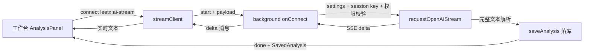

# AI 流式分析 + 工作台灵动化设计

日期：2026-08-09
状态：待用户审阅

## 1. 背景与问题

### 1.1 AI 分析超时（根因已确认）

现象：点击 AI 分析后 30 秒报"连接超时"，但模型服务方额度被正常扣减。

根因：当前 AI 请求为非流式 `fetch` + `AbortController` 30 秒硬超时
（`src/ai/provider.ts`）。非流式响应要等模型完整生成后才返回，
而分析输出预算为 `max_tokens: 4096`，普通模型完整生成常需 30–60 秒；
推理模型（思考链）首字节甚至可能超过 30 秒。服务方正常计费生成，
客户端提前断开，于是"扣费了但看不到结果"。

次要问题：
- 工作区版本设置面板删除了超时时间输入框，用户无法自行调大。
- 工作区版本删除了记录级"最终 AI 分析"入口，与 `plan.md` 2.3 节不符。
- AI 结果为空时不再显示"尚未调用 AI"提示，空面板看起来像坏了。

### 1.2 工作台风格不够灵动

当前界面为深色 + 青柠荧光三栏布局，品牌基调保留，但缺少过渡、
反馈与层次动效；`App.tsx`/`style.css` 被压缩成单行，无法维护。

### 1.3 已确认的决策

- AI 修复采用 A2 方案：SSE 流式请求 + `chrome.runtime` Port 长连接。
- API Key 只存 `chrome.storage.session`（重启浏览器后需重填），不新增持久化选项。
- 前端走方向 A：保留深色 + 青柠基调，重点加动效与交互质感。

## 2. 目标与非目标

目标：
1. AI 分析在慢模型/推理模型下可用，过程实时可见，结果照常落库可回看。
2. 恢复记录级最终分析入口与空态提示。
3. 工作台获得系统的动效与交互反馈，遵循 `prefers-reduced-motion`。
4. `App.tsx`/样式拆分为可读模块，单文件 100–300 行，符合 `plan.md` 工程质量要求。

非目标：
- 不引入自动分析（保持用户显式触发）。
- 不迁移 Tailwind/Dexie，不改动采集链路。
- 不重做 Popup（仅保持主题变量兼容）。
- 不做 AI 输出的 Markdown 富渲染（沿用 JSON 结构化展示 + 文本兜底）。

## 3. AI 流式链路设计

### 3.1 总览



### 3.2 Provider 流式请求（`src/ai/provider.ts`）

新增 `requestOpenAIStream(settings, apiKey, prompt, options)`：

- 请求体沿用现有结构，增加 `stream: true`；端点归一化、Key 校验、
  HTTP 错误详情等现有行为不变，提取为共享内部函数避免重复。
- `options.onDelta(text: string)`：每收到一段 `choices[0].delta.content`
  即回调累积文本增量。
- SSE 解析：按行读取 `data: ` 前缀，忽略空行与心跳注释，遇
  `data: [DONE]` 结束；单个 data 负载 JSON 解析失败时抛
  "Provider 返回了无法解析的流式数据"。
- 兜底：响应 `content-type` 含 `application/json` 时按现有非流式
  逻辑解析（兼容忽略 `stream` 参数的端点）。
- 超时语义改为两段：
  - 空闲超时：60 秒没有任何 SSE 数据则中止（推理模型思考期通常 < 60s，
    且思考内容会以 reasoning delta 持续流出）。
  - 总超时：`settings.timeout`，默认从 30s 提升到 180s，
    上限沿用 schema 的 300s。
- 完成后对累积全文执行现有 `parseAIContent`（去代码围栏 → JSON.parse
  → 兜底 text），返回 `AIContent`。
- 现有 `requestOpenAI` 保留，供"测试连接"使用；其默认超时随设置。

### 3.3 Port 协议（`src/ai/streamProtocol.ts`）

Port 名称：`leetx:ai-stream`。

客户端 → 后台（仅一条）：
```ts
{ kind: 'start'; scope: 'node' | 'record'; current?: CaptureEntry;
  previous?: CaptureEntry; problemKey?: string; submissions?: CaptureEntry[] }
```

后台 → 客户端：
```ts
{ kind: 'delta'; text: string }        // 文本增量，可多次
{ kind: 'done'; analysis: SavedAnalysis } // 已落库的最终结果
{ kind: 'error'; message: string }      // 配置/权限/网络/解析错误
```

约束：
- 后台校验 `port.sender.id === chrome.runtime.id` 且
  `port.sender.url` 以 `chrome.runtime.getURL('/')` 开头，否则立即断开。
- 每个 Port 同时只允许一个进行中的分析；重复 `start` 返回 error。
- Port 断开（页面关闭/刷新/用户取消）时中止进行中的 `fetch`。
- `start` 的 payload 结构与现有 `leetx/analyze-node|record` 消息一致，
  后台复用同一套 prompt 构造函数与 `saveAnalysis`。

### 3.4 客户端封装（`src/ai/streamClient.ts`）

```ts
export function streamAnalysis(
  request: StreamStart,
  handlers: { onDelta(text: string): void; onDone(a: SavedAnalysis): void;
              onError(message: string): void }
): () => void // 返回取消函数（断开 Port）
```

内部处理：连接、发送 start、分发消息、done/error 后自动断开。
页面组件只面对这个函数，不直接操作 Port。

### 3.5 后台改动（`src/ai/streamServer.ts` + `entrypoints/background.ts`）

- 处理逻辑放进新模块 `src/ai/streamServer.ts`，以依赖注入方式接收
  设置读取、Key 读取、权限校验、prompt 构造与落库函数，便于单测。
- `entrypoints/background.ts` 只做接线：`chrome.runtime.onConnect`
  监听 `leetx:ai-stream`，构造依赖后交给 `streamServer`。
- 流式分析复用现有 `settings()`/`key()`/`requirePermission()` 与
  `nodeAnalysisPrompt`/`recordAnalysisPrompt`。
- 保留现有 `leetx/analyze-node|record` 非流式消息一个迭代周期，
  供 Popup 或测试兜底使用；UI 不再调用。

### 3.6 设置面板

- 恢复"超时时间（秒）"输入框，默认 180，范围 60–300。存储层统一保持
  毫秒（schema 不变），UI 加载时除以 1000 展示、保存时乘回 1000。
- 默认超时 `DEFAULT_AI_SETTINGS.timeout` 从 30000 改为 180000。
- API Key 维持 `chrome.storage.session`，面板文案说明"仅存本次会话"。

## 4. 工作台 UI 与动效设计

### 4.1 组件拆分

```
entrypoints/app/
  App.tsx            # 编排：数据加载、选中态、消息调用（≤250 行）
  components/
    TopBar.tsx       # 品牌、状态胶囊、主题/设置按钮
    RecordList.tsx   # 筛选 + 记录卡片列表
    TimelinePanel.tsx# 题目信息、记录总结、最终分析、提交时间线
    DetailPanel.tsx  # 面包屑、代码卡（含 Diff）、分析面板
    AnalysisPanel.tsx# 本地确定性分析 + AI 流式分析区
    SettingsModal.tsx
    bits.tsx         # PlatformIcon、HighlightedCode、Empty、Toast
```

样式拆分为 `style.css`（token/主题/布局）与 `motion.css`
（动效 token、keyframes、reduced-motion 覆写），入口按顺序引入。
所有文件改为正常多行格式。

### 4.2 动效系统（纯 CSS，无新依赖）

Token：`--dur-fast: 120ms`、`--dur: 200ms`、`--dur-slow: 320ms`，
缓动统一 `cubic-bezier(.2,.7,.3,1)`。

- 记录卡片：hover/active 背景与边框 200ms 过渡；列表项 stagger 渐入
  （每项 20ms 延迟上限 8 项，避免长列表拖沓）。
- 时间线节点：选中态圆点颜色/阴影过渡；新增提交节点 pop-in。
- 详情区：切换提交节点时内容 120ms 淡入（key 变更触发 CSS animation）。
- 主题切换：`background-color`/`color`/`border-color` 200ms 过渡，
  仅作用于面板与控件类选择器，不用全局 `*`。
- 模态框：遮罩淡入 + 面板 8px 上移淡入；Toast 沿用现有动画。
- AI 分析：流式期间实时文本 + 呼吸光标；完成后 160ms 淡入结构化视图。
- 判定徽标（ok/bad）：颜色过渡；新增 `prefers-reduced-motion: reduce`
  时全部动画降级为即时切换。

### 4.3 恢复与修正

- 恢复时间线面板的记录总结行与"最终 AI 分析"按钮（流式）。
- 恢复 AI 空态提示："尚未调用 AI，不会自动产生费用。"
- 分析按钮三态：开始分析 → 分析中（可点击取消）→ 重试/重新分析。

## 5. 测试策略

- `provider.test.ts` 扩展：SSE 多 chunk 累积、`[DONE]` 终止、
  `content-type: application/json` 兜底、HTTP 错误详情透传、
  空闲超时中止（fake timers）、非 ASCII Key 拒绝、`stream: true` 入参断言。
- `streamClient` 测试：mock `chrome.runtime.connect`，覆盖
  delta 聚合、done/error 分发、取消函数断开 Port。
- 后台 Port 处理测试：mock chrome，覆盖 sender 校验拒绝、
  配置缺失返回 error、断开后中止请求。
- 组件级（jsdom）：AnalysisPanel 流式态/完成态/错误态渲染。
- 现有测试保持全绿；修复 `sha256Hex` 测试环境缺少 WebCrypto 的问题
  （vitest setup 注入 `node:crypto` 的 `webcrypto`）。
- 验证命令：`npm test` 与 `npm run build`（需 Node ≥ 20，
  本机使用 `/Users/bytedance/.nvm/versions/node/v24.16.0`）。

## 6. 验收标准

1. 配置一个慢端点（如推理模型）发起节点分析，界面逐字实时渲染，
   30 秒内不再误报超时；完成后结果落库并可重新查看。
2. 推理模型空闲超过 60 秒无任何输出时提示超时；总时长超过设置值时
   中止并保留已生成文本提示失败。
3. 设置面板可调整超时时间；Key 仅存会话，重启浏览器后提示重新配置。
4. 时间线面板可发起记录级最终分析，流式过程与节点分析一致。
5. 面板切换、选中、主题切换、模态框均有过渡；系统开启"减弱动态效果"
   后动画关闭。
6. `npm test` 全绿、`npm run build` 通过。
7. 真机回归：leetcode.cn 提交一次后完整走通"采集 → 节点分析 →
   最终分析"流程（由用户执行，结果记入 `docs/stage0-verification.md`）。

## 7. 风险与缓解

- SSE 解析兼容性：不同 OpenAI 兼容端点的流格式存在细微差异，
  用 content-type 兜底 + 单行解析失败即报错并展示服务方原文。
- Port 与 MV3 休眠：活跃 Port 会重置 SW 空闲计时，流式期间天然保活；
  端点超长空闲时由空闲超时兜底中止。
- 重构回归：组件拆分为纯搬运 + 格式化，不改数据流；测试先行锁定行为。
