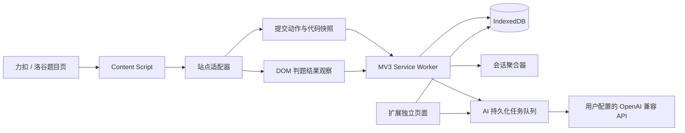

# leetX 浏览器扩展落地方案

## 1. 结论

leetX 当前仓库为空，适合从浏览器扩展架构开始搭建。建议实现为一个本地优先、无需自建后端、兼容 Chrome 与 Edge 的 Manifest V3 扩展。扩展在力扣和洛谷题目页采集提交代码与可见判题结果，使用可配置的相邻提交时间窗口把同一题的连续提交聚合为一条刷题记录，并在独立扩展页面中以三栏布局展示历史记录、提交时间线、代码与 AI 分析。

第一版应优先保证“代码不丢、记录不错合并、采集失败可见且可修复”，而不是追求完全自动化。核心采集路径不依赖站点私有 GraphQL、提交历史或判题接口，以降低网站改版、登录态、风控与扩展商店审核风险。

## 2. 产品边界与关键定义

### 2.1 记录

一条记录代表某个平台、某个账号、某道题的一次连续刷题会话。聚合键为 `platform + accountKey + problemKey`。当当前提交与上一提交的间隔小于或等于用户配置的窗口时，两次提交属于同一条记录；超过窗口则创建新记录。

建议默认窗口为 90 分钟，允许配置为 15–240 分钟。窗口采用“相邻提交滚动间隔”，而不是“从第一次提交开始的固定截止时间”。例如 10:00、10:40、11:50 三次提交在 90 分钟窗口下属于同一记录，因为相邻间隔分别为 40 和 70 分钟。

Accepted 不立即关闭记录，用户可能继续优化。记录在超过窗口后自然进入可总结状态。用户可手工拆分、合并或锁定记录；被手工调整的记录不再被自动重聚合覆盖。

### 2.2 节点

每次提交被保存为一个节点。节点至少包含提交时间、平台、题目、语言、代码、判题状态、运行时间、内存、错误摘要、采集可信度和 AI 分析状态。提交动作发生时立即先保存代码并创建 `pending` 节点，页面随后出现判题结果时再更新同一节点。

如果用户提交后立即关闭页面，扩展只能保证代码和提交时间已保存，不能在完全不依赖站点接口的情况下保证拿到最终判题结果。此时节点显示为“结果待补齐”，用户下次访问相关页面时尝试补齐，也可以手工修正。

### 2.3 分析

分析分为节点分析和记录最终分析。节点分析聚焦当前代码的问题、错误原因、复杂度、相对上一提交的变化和修改建议。最终分析聚焦整个解题过程，包括错误演进、关键修正、最终解法、复杂度、可复用知识点与复习建议。

AI 分析应由用户明确触发。第一版不建议每次提交后自动调用，以免产生不可控费用。后续可增加“Accepted 后自动分析”或“记录结束后自动总结”的可选开关。

## 3. 推荐技术选型

| 层级 | 选型 | 原因 |
|---|---|---|
| 扩展框架 | WXT + TypeScript | 原生支持 Manifest V3、内容脚本、多页面入口及 Chrome/Edge 构建 |
| UI | React | 适合复杂三栏交互与状态管理 |
| 样式 | Tailwind CSS | 快速构建一致的扩展界面与暗色模式 |
| 本地数据库 | Dexie + IndexedDB | 适合保存代码、提交、记录、分析与任务队列，支持版本迁移 |
| UI 状态 | Zustand | 只管理选择态、筛选条件和面板状态，避免过重方案 |
| 数据校验 | Zod | 校验站点采集结果、配置和 AI 结构化响应 |
| 代码展示 | CodeMirror 6 只读模式 | 支持语法高亮、行号与大代码文本 |
| Diff | diff | 展示当前提交相对上一提交的修改 |
| Markdown | react-markdown + DOMPurify | 安全展示模型输出，禁止执行 HTML 与脚本 |
| 测试 | Vitest + jsdom + Playwright | 覆盖聚合逻辑、站点适配器和扩展端到端流程 |

不建议第一版引入自建后端、用户系统、云同步、Redux、CRDT、自动多 Agent 流程或 Side Panel 主界面。

## 4. 总体架构



### 4.1 Content Script

Content Script 负责识别当前题目、监听 SPA 路由、捕获提交动作、读取代码快照和观察页面可见判题结果。它只传递经过校验的提交事件，不接触 API Key，也不直接调用 AI。

### 4.2 站点适配器

力扣与洛谷分别实现适配器。站点选择器、路由规则、编辑器读取、状态文案映射全部限制在适配器目录中，聚合、存储和 UI 不得引用站点 DOM。

```ts
interface JudgeAdapter {
  platform: 'leetcode-cn' | 'leetcode-com' | 'luogu'
  matchLocation(url: URL): boolean
  observeRouteChange(callback: () => void): () => void
  getProblemIdentity(): Promise<ProblemIdentity | null>
  observeSubmit(callback: (event: SubmitIntent) => void): () => void
  readEditorSnapshot(): Promise<CodeSnapshot | null>
  observeVerdict(callback: (result: VerdictSnapshot) => void): () => void
}
```

### 4.3 Page Bridge

内容脚本运行在隔离世界，必要时无法直接访问 Monaco 或 CodeMirror 的编辑器对象。可注入扩展包内的最小 MAIN-world bridge，仅提供 `GET_EDITOR_SNAPSHOT` 能力。通信包含随机 nonce 与请求 ID，返回值必须做类型、长度和语言校验。API Key、数据库记录和 AI 配置永远不得进入页面上下文。

### 4.4 Service Worker

Service Worker 负责事件校验、幂等去重、记录聚合、数据库写入、AI 请求调度和任务恢复。Manifest V3 后台可能随时休眠，所以不能依赖全局变量、`setInterval` 或长期连接保存关键状态。所有状态先落库，使用 `chrome.alarms` 唤醒并恢复过期任务。

### 4.5 扩展主页面

主功能打开为独立标签页 `app.html`。Popup 只提供“打开 leetX”“当前页面采集状态”等快捷操作。独立页面比 Side Panel 更适合稳定展示三栏、代码 Diff 和长分析。

## 5. 提交采集方案

### 5.1 捕获顺序

提交按钮点击或提交快捷键被识别后，适配器立即读取平台、账号、题目标识、标题、URL、语言、完整代码与客户端时间，并生成本地 `captureId`。后台先创建 `pending` 节点并持久化代码，再等待判题区域变化。这样即使页面随后关闭，代码也不会丢失。

判题结果通过 `MutationObserver` 观察页面可见结果区域。监听应绑定稳定祖先节点，并进行 100–300ms debounce。只有状态进入终态时才更新数据库，同时保留原始状态文本。

统一状态建议为 `pending`、`accepted`、`wrong_answer`、`time_limit_exceeded`、`memory_limit_exceeded`、`runtime_error`、`compile_error`、`output_limit_exceeded`、`cancelled` 和 `unknown`。

### 5.2 编辑器读取优先级

代码读取依次尝试原生 textarea 或可编辑 DOM、Monaco model、CodeMirror document model、页面中完整渲染的代码文本，最后降级为手工保存。不要通过可视行 DOM 拼接代码，因为虚拟滚动会漏掉不可见行；也不要使用截图 OCR、`chrome.debugger`、全局网络劫持或站点私有接口。

### 5.3 提交与结果关联

若页面公开展示远端提交 ID，则使用 `platform + remoteSubmissionId` 精确关联。否则关联同标签页、同题目、最近的 pending 节点，并结合提交时间和代码哈希判断。无法唯一匹配时保持“待确认”，不能猜测更新。

无远端 ID 时，建议幂等键为 `platform + problemKey + accountKey + floor(submittedAt / 5秒) + language + codeHash`。不能只按代码哈希去重，因为用户可能有意重复提交相同代码。

### 5.4 SPA 路由与适配器健康

力扣和洛谷都可能在不刷新页面的情况下切换题目。适配器需要监听 History API、`popstate` 与必要的 DOM 变化，路由改变后销毁旧监听并重新初始化。页面结构无法识别时，应在扩展图标和主页面展示“当前站点适配器需要更新”，不能静默丢数据。

## 6. 会话聚合算法

聚合只针对同一 `platform + accountKey + problemKey` 的节点。节点按 `submittedAt, createdAt, id` 稳定排序。相邻节点间隔小于或等于 `windowMinutes` 时归入同一记录，否则新建记录。

补录旧节点或修改窗口后，后台对受影响题目执行局部重聚合，而不是仅追加到最后一条记录。重聚合在单个 IndexedDB 事务中完成，保留用户备注、分析和手工锁定关系。窗口修改应先展示影响预览，用户确认后再应用；已有分析受到影响时标记为“已过期”。

```ts
interface AggregationPolicy {
  mode: 'rolling-gap'
  windowMinutes: number
  policyVersion: 1
}
```

记录结束条件是最后一次提交后超过窗口。可使用 `chrome.alarms` 定期把 active 记录标记为 finalized，但即使 alarm 未及时运行，主页面查询时也应按当前时间即时推导状态。

## 7. 数据模型

### 7.1 核心实体

```ts
interface Problem {
  id: string
  platform: Platform
  canonicalId: string
  title: string
  canonicalUrl: string
  firstSeenAt: number
  lastSeenAt: number
}

interface PracticeSession {
  id: string
  platform: Platform
  accountKey: string
  problemId: string
  startedAt: number
  lastSubmittedAt: number
  status: 'active' | 'finalized' | 'archived'
  nodeCount: number
  finalVerdict?: Verdict
  aggregationPolicy: AggregationPolicy
  aggregationLocked: boolean
  finalAnalysisId?: string
  userNote?: string
  createdAt: number
  updatedAt: number
}

interface SubmissionNode {
  id: string
  sessionId: string
  problemId: string
  captureId: string
  remoteSubmissionId?: string
  tabSessionId?: string
  submittedAt: number
  verdict: Verdict
  rawVerdict?: string
  language: string
  runtimeText?: string
  memoryText?: string
  errorSummary?: string
  codeBlobId?: string
  codeHash?: string
  sourceUrl: string
  captureMethod: 'editor-model' | 'textarea' | 'rendered-code' | 'manual'
  captureConfidence: 'high' | 'medium' | 'low'
  analysisId?: string
  createdAt: number
  updatedAt: number
}

interface CodeBlob {
  id: string
  sha256: string
  content: string
  byteLength: number
  createdAt: number
}
```

CodeBlob 按 SHA-256 内容寻址可以节省重复代码占用，但 SubmissionNode 不能因此去重。

```ts
interface Analysis {
  id: string
  targetType: 'submission' | 'session'
  targetId: string
  providerConfigId: string
  model: string
  promptVersion: string
  inputHash: string
  status: 'queued' | 'running' | 'succeeded' | 'failed' | 'cancelled'
  structuredResult?: AnalysisResult
  rawText?: string
  errorCode?: string
  attempts: number
  createdAt: number
  updatedAt: number
}

interface AiJob {
  id: string
  analysisId: string
  idempotencyKey: string
  state: 'queued' | 'leased' | 'retry_wait' | 'completed' | 'dead'
  attempt: number
  leaseUntil?: number
  nextAttemptAt?: number
  lastError?: string
}
```

### 7.2 存储分工

IndexedDB 保存题目、记录、节点、代码、分析和任务队列。`chrome.storage.local` 只保存窗口设置、UI 偏好、Provider 元数据和 schema 版本。API Key 默认保存在 `chrome.storage.session`，浏览器完全退出后失效；如用户主动选择持久保存，则写入只允许可信扩展上下文访问的 `chrome.storage.local`，并明确提示本地客户端无法达到服务端密钥保护级别。

## 8. AI 集成方案

### 8.1 OpenAI 兼容配置

设置页提供 Base URL、API Key、模型名、超时时间、额外 Organization Header 和密钥保存方式。默认 Base URL 可采用 OpenAI Chat Completions 兼容路径，Provider 层负责拼接和能力探测。

用户保存自定义 Base URL 时，扩展通过用户点击动作申请该精确 origin 的可选 host permission。默认只允许 HTTPS；localhost 与 127.0.0.1 需要单独确认。禁止 `file:`、`data:`、`javascript:`、浏览器内部协议和 URL 内嵌用户名密码。

### 8.2 请求数据范围

节点分析只发送当前题目的必要信息、当前代码、判题状态、错误摘要以及可选的上一节点 Diff。最终分析发送首次代码、关键节点 Diff、判题演进、最终代码与已有节点摘要，避免重复发送每个节点的完整代码。

默认不发送用户名、Cookie、页面完整 HTML、浏览历史或其他题目代码。分析前展示预计发送内容范围，并提供“仅当前节点”“当前节点与上一节点”“完整记录”三个粒度。

### 8.3 结构化输出

节点分析结构包括摘要、正确性、复杂度、问题列表、改进建议和下一步。最终分析结构包括过程总结、错误演进、最终方案、复杂度、知识点和复习建议。优先请求 JSON Schema；兼容端点不支持时尝试解析 JSON，失败则保存为纯文本，不能无限重试格式修复。

题目、代码、编译错误和模型输出都视为不可信数据。System Prompt 明确规定数据区指令不能改变任务。Markdown 禁止 raw HTML，并经过净化后渲染。任何模型输出均不得被当作扩展命令或可执行代码。

### 8.4 任务恢复

AI 调用前先创建 Analysis 和 AiJob。Worker 获取带过期时间的 lease 后发起非流式请求；成功则事务性写入结果，失败按错误类型处理。网络异常、408、429 和 5xx 使用带抖动的 5 秒、30 秒、2 分钟退避，最多自动尝试 3 次。401、403、404、400、输入超限和用户取消不自动重试。

Service Worker 被回收后，下一次 alarm 或扩展事件扫描过期 lease 并恢复任务。幂等键由 provider origin、model、target、inputHash 和 promptVersion 计算。相同输入已有成功分析时直接复用；用户点击“重新分析”时创建新版本。

## 9. 页面与交互设计

### 9.1 整体布局

页面使用可调整宽度的三栏布局。建议初始比例为 260px、300px、剩余宽度，最小窗口宽度不足时折叠左栏，而不是压缩代码区。

左栏顶部固定“历史”“最终分析”“API 配置”入口，下方显示记录搜索、平台筛选和按日期分组的刷题记录。记录项展示平台、题目、开始时间、最后提交时间、节点数、最终状态、AI 状态和采集异常标记。

中栏使用纵向时间线。节点展示提交时间、语言、Verdict、运行时间、内存、AI 状态和相对上一节点的代码变更行数。`pending`、采集不完整、AI 失败等状态需要有明确视觉区分。

右栏占据最大宽度，顶部显示题目与当前节点摘要，下方提供“当前代码”“与上一提交 Diff”“节点分析”“原始错误”页签。记录级最终分析在右栏提供独立模式，并从左上角快速进入。

### 9.2 关键交互

用户点击记录后加载对应时间线，默认选中最后一个节点；点击节点后右栏更新代码与分析。节点可手工修正状态、补充代码、删除或移动。记录可拆分、合并、锁定、归档和重新分析。窗口设置修改时先展示将受影响的记录数量。

配置区提供“测试连接”，只发送最小探测请求并展示 HTTP 状态、模型可用性和结构化输出兼容性。API Key 只显示掩码，支持一键清除。

## 10. Manifest 与权限

```json
{
  "manifest_version": 3,
  "permissions": ["storage", "alarms"],
  "host_permissions": [
    "https://leetcode.cn/*",
    "https://www.luogu.com.cn/*"
  ],
  "optional_host_permissions": [
    "https://leetcode.com/*",
    "https://*/*",
    "http://localhost/*",
    "http://127.0.0.1/*"
  ]
}
```

AI 域名应在配置保存时按精确 origin 动态申请，而不是安装时直接获得全部网站访问权。第一版不申请 `cookies`、`history`、`debugger` 或 `webRequest`。所有 React、编辑器、Markdown、桥接脚本和依赖必须随扩展打包，不能加载远程可执行代码。

## 11. 目录与变更文件设计

leetX 当前为空，初始化后建议使用以下结构。所有组件尽量控制在 100–300 行，超过 300 行继续拆分。

```text
leetX/
├── package.json
├── wxt.config.ts
├── tsconfig.json
├── vitest.config.ts
├── playwright.config.ts
├── assets/
├── entrypoints/
│   ├── background.ts
│   ├── content.ts
│   ├── popup/
│   │   ├── index.html
│   │   └── App.tsx
│   └── app/
│       ├── index.html
│       └── App.tsx
├── src/
│   ├── adapters/
│   │   ├── types.ts
│   │   ├── registry.ts
│   │   ├── leetcode/
│   │   │   ├── adapter.ts
│   │   │   ├── editor.ts
│   │   │   ├── selectors.ts
│   │   │   └── verdict.ts
│   │   └── luogu/
│   │       ├── adapter.ts
│   │       ├── editor.ts
│   │       ├── selectors.ts
│   │       └── verdict.ts
│   ├── bridge/
│   │   ├── pageBridge.ts
│   │   └── protocol.ts
│   ├── capture/
│   │   ├── captureController.ts
│   │   ├── normalize.ts
│   │   └── deduplicate.ts
│   ├── db/
│   │   ├── database.ts
│   │   ├── schema.ts
│   │   └── repositories/
│   ├── aggregation/
│   │   ├── aggregateSessions.ts
│   │   └── reaggregate.ts
│   ├── ai/
│   │   ├── provider.ts
│   │   ├── openaiCompatible.ts
│   │   ├── prompts.ts
│   │   ├── queue.ts
│   │   ├── runner.ts
│   │   └── schemas.ts
│   ├── messaging/
│   │   ├── messages.ts
│   │   └── handlers.ts
│   ├── components/
│   │   ├── layout/ThreePaneLayout.tsx
│   │   ├── sessions/SessionList.tsx
│   │   ├── timeline/SubmissionTimeline.tsx
│   │   ├── detail/SubmissionDetail.tsx
│   │   ├── code/CodeViewer.tsx
│   │   ├── code/CodeDiff.tsx
│   │   ├── analysis/AnalysisPanel.tsx
│   │   └── settings/ProviderSettings.tsx
│   ├── pages/
│   │   ├── HistoryPage.tsx
│   │   ├── SessionPage.tsx
│   │   └── SettingsPage.tsx
│   ├── stores/
│   │   └── uiStore.ts
│   ├── hooks/
│   └── utils/
└── tests/
    ├── aggregation/
    ├── adapters/fixtures/
    ├── adapters/
    └── e2e/
```

## 12. 分阶段实施计划

### 阶段 0：采集可行性验证

先只构建最小扩展，不做完整 UI。分别在力扣和洛谷验证题目标识、完整代码读取、提交按钮与快捷键识别、判题结果 DOM 捕获、SPA 路由重建与重复渲染去重。每个平台至少覆盖多道题和两种语言。验收标准是代码、时间和状态可稳定保存，失败时有明确原因而不是静默丢失。这是项目的 Go/No-Go 阶段。

### 阶段 1：本地记录 MVP

完成 WXT 工程、两站适配器、IndexedDB、滚动窗口聚合、三栏主页面、代码展示、Diff、pending 状态、手工修正、删除、拆分、合并、锁定与 JSON 导入导出。此阶段暂不接 AI，重点验证记录正确性和恢复能力。

### 阶段 2：节点 AI 分析

完成 OpenAI 兼容配置、动态 host permission、API Key 会话保存、连接测试、单节点分析、结构化输出、安全渲染、持久化任务与失败重试。默认由用户点击分析。

### 阶段 3：记录最终分析

完成记录结束识别、关键节点 Diff 压缩、最终分析、分析版本、输入哈希、过期标记与重新生成。增加费用预估或输入规模提示。

### 阶段 4：稳定性与发布

完成适配器健康检查、数据库迁移测试、大数据量性能测试、Chrome/Edge 构建、权限说明、键盘操作、可访问性、存储容量提醒和扩展商店发布材料。

## 13. 测试与验收

聚合算法需要覆盖窗口边界、跨平台隔离、多账号、乱序补录、窗口修改、手工锁定和 Accepted 后继续提交。适配器测试使用最小 HTML fixture 覆盖题目标识、提交动作、状态映射与选择器失效。端到端测试使用本地模拟题目页验证从点击提交到三栏页面出现节点的完整流程，不应在 CI 中直接依赖真实网站。

人工验收需要分别在 Chrome 与 Edge 最新稳定版完成。重点场景包括正常提交、连续多次 WA 到 AC、重复提交相同代码、提交后立即关闭页面、SPA 切题、浏览器重启、AI 超时、错误 Key、429、窗口修改和数据导入导出。

## 14. 主要风险与应对

| 风险 | 应对策略 |
|---|---|
| 网站 DOM 或编辑器升级 | 适配器隔离、多层 extractor、健康检查、手工补录 |
| 提交后立即关闭页面 | 先保存代码，结果保持 pending，下次访问或手工补齐 |
| 私有接口变化与风控 | 核心链路不调用私有接口，只观察用户可见页面 |
| Service Worker 被回收 | 状态持久化、lease、alarms、幂等恢复 |
| 自定义 OpenAI 端点兼容性差 | Provider 适配层、连接测试、JSON 失败降级纯文本 |
| API Key 泄露 | 默认 session 保存、可信上下文调用、禁止传入 content/page world |
| AI 输出恶意内容 | Zod 校验、禁 raw HTML、DOMPurify、不执行模型输出 |
| 窗口修改导致历史变化 | 影响预览、用户确认、手工锁定、分析过期标记 |
| 多账号记录混合 | 尽量读取页面公开账号；无法识别时显示 anonymous 并支持手工移动 |
| 扩展卸载导致本地数据丢失 | JSON 导入导出、定期备份提醒、明确卸载风险 |

## 15. 建议的首个迭代

首个迭代只做阶段 0，时间控制在 2–4 个开发日。先验证力扣与洛谷当前页面上能否稳定拿到“题目标识、完整代码、提交动作、判题结果”四类数据。只有两站采集路径验证通过后，再开始三栏 UI 和 AI 集成。这样可以最早暴露整个产品最不确定、维护成本最高的风险，避免先投入大量页面开发后发现采集不可行。
